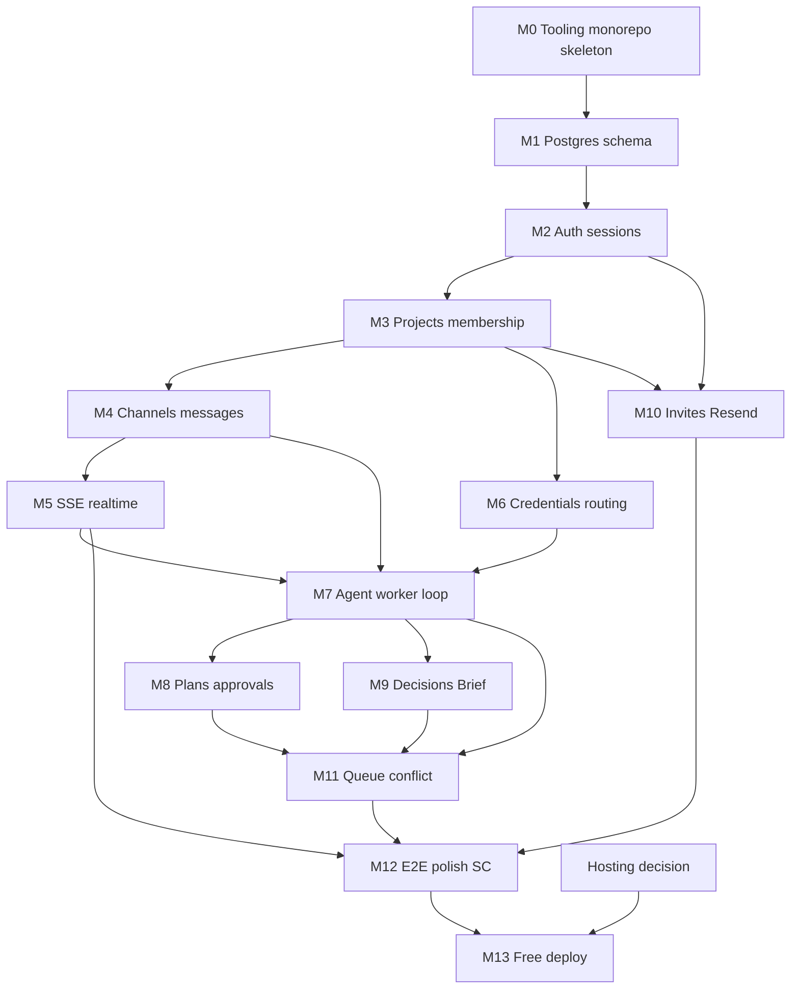

# PHASE_1_IMPLEMENTATION_PLAN

## Document control

| Field | Value |
| --- | --- |
| Status | **Go for M0–M12 local** (M13 still waits on HOST-1) |
| Created | 2026-10-09 |
| Last updated | 2026-10-09 |
| Coding ban | **Lifted** for Phase 1 local implementation M0–M12 (SoT ADR-000 superseded; ADR-027). M13 still gated on HOST-1. |
| Related SoT | `SOURCE_OF_TRUTH.md` |

---

## Section A: Purpose and relationship to project documentation

### Purpose

This document translates the **accepted Phase 1 design** into a dependency-aware plan for building, integrating, validating, and deploying a working MVP collab room — without rewriting product requirements.

### Phase 1 scope (pointer)

Phase 1 = **Live collab room** (SoT ADR-004/005/025): multi-human + orchestrator + fixed specialists, per-agent channels, plans/approvals, Brief/Decision Log, BYOK multi-provider with per-agent routing, worker loops + traces + simple skills, Resend invites, Google + email auth. **Not** GitHub/repo, coding sandboxes, MCP, nested spawn.

### Document authority

| Concern | Authoritative document |
| --- | --- |
| What the system must do; ADRs; FRs; SCs; scope | **`SOURCE_OF_TRUTH.md`** |
| How we sequence build, verify, deploy | **`PHASE_1_IMPLEMENTATION_PLAN.md`** (this file) |

### Conflict handling

1. If this plan contradicts SoT → **SoT wins** until an explicit ADR/FR change is approved.  
2. Propose smallest SoT correction → owner approval → update SoT → sync this plan → log both change logs.  
3. This plan must **not** silently expand into Phase 2–4 (P1-OUT-*).

### Relationship note

Do not duplicate entire SoT. Reference IDs: `FR-*`, `SC-*`, `UF-*`, `ADR-*`, `API-*`, `P1-IN-*`.

---

## Section B: Phase 1 scope and definition of done

### Must deliver (user-visible)

Aligned to P1-IN-* / UF-001..012 / SC-001..012:

- Auth: email+password, magic link, Google OAuth; change-email (UF-001, ADR-016/019)
- Create project → Orchestrator agent+channel; Owner BYOK (multi-cred, primary/fallback, per-agent routing) (UF-002, ADR-026)
- Invites: existing user + email-to-signup via Resend (UF-003/004, ADR-018)
- WhatsApp-like channel list; per-agent chats; SSE live updates (UF-005/011, ADR-022)
- Spawn specialists (fixed set, each gets channel) (UF-006, FR-035)
- Plan draft → Owner approve/reject (UF-007, ADR-007)
- Decision propose / Member support / Owner accept → Brief + notices (UF-008, ADR-023)
- Queue + Q&A while busy; conflict → Owner resolve (UF-009/010)
- Spend cap + pause (UF-012, SC-012)
- Responsive web (SC-008)
- Idle durability without warm per-project VM (SC-011, ADR-010)

### Backend / data

- Postgres as sole primary store (ADR-015); entities per SoT §11
- Hono/Bun API + agent workers; Next.js UI (ADR-015)
- Encrypted Owner credentials; never Member billing keys (ADR-011)

### Integrations that must function

- Google OAuth (vendor docs)
- Resend (default) / SMTP port (ADR-018)
- At least one LLM provider E2E via Owner key; design supports multi-provider (ADR-026)

### AI behavior (Phase 1)

- Worker loop, packed context, skills as playbooks, traces (ADR-020/021, Track D)
- No MCP, no coding tools, no nested spawn

### Security / reliability expectations (MVP bar)

- Session authZ Owner vs Member; Owner-only gates
- Secrets encrypted at rest; masked in API
- Cap/pause stops new LLM spend
- Not enterprise SSO/compliance

### Deployment expectations

- Local + free/low-cost online + path to paid later (SC-010, ADR-014)
- **Exact free-tier hosts: unresolved** → see readiness + Section J

### Explicit exclusions (Phase 1)

P1-OUT-001..007; ADR-024 workspace; employee multi-person keys (FR-024)

### Definition of done (system, not parts)

Phase 1 is **complete** only when:

1. SC-001..012 can be demonstrated (SC-009 qualitative pilot included).  
2. Critical path UF-001→002→005→006→007→008→003/004 works on **local** and at least one **deployed** free/low-cost environment.  
3. Two humans see the same channel SSE updates; idle reopen restores history.  
4. No Phase 2–4 features required for the demo.

### Incomplete if

- Agents only work in single-player with no shared visibility  
- Context lost on redeploy/idle  
- No Owner gates on plan/decision/conflict  
- BYOK missing or keys logged plaintext  
- “Done” claimed as isolated unit tests without E2E flow

---

## Readiness assessment

| Item | Status | Reason | Dependencies | Next action |
| --- | --- | --- | --- | --- |
| Phase 1 scope / exclusions | **Ready** | ADR-004/005/025 accepted | — | Freeze |
| Success criteria SC-001..012 | **Ready** | Accepted | — | Use as DoD |
| Stack (Next/Hono/Bun/Postgres/Zod) | **Ready** | ADR-015 | Tooling install | M0 |
| HLD + Channels + Brief | **Ready** | ADR-022/023/025 | — | Freeze |
| Flows UF-001..012 | **Ready** | Accepted | — | Drive tests |
| Data model (conceptual) | **Ready** | §11 accepted; M1 DDL in `apps/api/migrations` | — | M2 uses the schema |
| Agent runtime Track D | **Ready** | D7 / IMP-NUM-001 **Accepted** | — | Freeze |
| Internal APIs Track C | **Ready** | Accepted contracts | — | Implement against §10 |
| Google OAuth | **At risk** | Decision made; app credentials not created; vendor behavior not re-verified this session | Google Cloud OAuth client | Spike: create clients; verify redirect |
| Resend email | **At risk** | ADR-018; free-tier limits **Unverified** | Resend account + domain | Spike: verify limits/docs |
| LLM multi-provider | **At risk** | ADR-026; exhaustion = best-effort | Provider keys | Spike: error-class mapping per provider |
| SSE on free hosts | **At risk** | Chosen in HLD; free-tier connection/timeout limits unknown | Hosting choice | **Resolve hosting** |
| Free-tier hosting topology | **Ready with assumptions** | Owner chose **defer** (IMP-Q-001 option 3): local M0–M12 first; friends via local/tunnel; vendor pick at M13 | ADR-014, SC-010 | Document assumption; run HOST-1 before M13 |
| Encryption at rest for keys | **Ready with assumptions** | Required; algo/KMS not specified | Env secret for key encryption | Decide envelope encryption with app secret for MVP |
| Contradiction detection quality | **At risk** | High risk in SoT; ledger helps but LLM miss possible | Instruction ledger design | Ship ledger + Owner resolve; don’t overclaim NLP |
| Security formal pass | **Ready with assumptions** | SEC-CHECK accepted (IMP-SEC-001) | This plan §L | Re-check rows as milestones complete; again at M12 and M13 |
| Phase 2–4 | **N/A** | Out of Phase 1 | — | Do not implement |
| Coding ban lift | **Unblocked** | ADR-000 superseded; ADR-027 accepted (2026-10-09) | SEC-CHECK remains binding | Implement M0, then continue milestone order |

### Four prior options — disposition

| Option | Disposition |
| --- | --- |
| 1. Free-tier hosting | **Required before deploy milestones** — treat as blocker for M7+; local M0–M6 can proceed with assumptions |
| 2. Numeric defaults | **Required before agent loop coding** — adopt D7 as provisional or owner-adjust; spend cap is Owner-set (no platform default $ required) |
| 3. Security/risk review | **Met** — SEC-CHECK accepted (IMP-SEC-001); re-check at M12 and M13 |
| 4. Stop / lift coding ban later | **Done** — owner lifted ADR-000 (ADR-027, IMP-Q-003) for M0–M12 local |

---

## Section C: Implementation dependency map

### Parallelism

| Parallel OK | Must stay sequential |
| --- | --- |
| Next UI shells while API auth built | Schema before membership |
| Resend spike while chat built | Credentials before real LLM runs |
| Hosting research anytime | SSE before claiming live collab |
| Skill prompt drafting anytime | Worker after messages + credentials |

### Critical path

**Auth → Project → Channel/Messages → SSE → Credentials → Agent loop → Plan/Decision gates → E2E → Deploy**

Longest delay risk: **hosting/SSE compatibility** and **LLM provider integration quirks**.

---

## Section D: Milestones and build order

Durations: **not estimated** (team = 2, no deadline). Need velocity samples after M0–M2 to forecast.

### M0 — Repository and local foundation

| | |
| --- | --- |
| **Objective** | Runnable empty Next + Hono/Bun + Postgres locally |
| **Why** | Unblocks all code later; validates toolchain |
| **Satisfies** | ADR-015, C-006/010, ADR-014 local path |
| **Prereq** | None (hosting not required) |
| **Work** | Monorepo or dual-package layout; lint/format; env template **names only**; dockerless local Postgres OK |
| **Outcome** | `dev` scripts documented; health endpoint |
| **Verify** | Both apps start; DB connect |
| **DoD** | Two developers can clone and run locally per README (written at coding time) |
| **Risks** | Bun/Next version skew |
| **Parallel** | Hosting research, Resend account creation |

### M1 — Schema and persistence layer

| | |
| --- | --- |
| **Objective** | Postgres schema matching SoT §11 |
| **Satisfies** | Track B, SC-011 durability |
| **Prereq** | M0 |
| **Work** | Migrations for User…Queue entities; encryption fields for credentials |
| **Outcome** | Empty DB migrates cleanly |
| **Verify** | Migrate up/down; constraint tests |
| **DoD** | All Phase-1 entities representable |
| **Risks** | Over-normalizing Brief JSON |

### M2 — Authentication

| | |
| --- | --- |
| **Objective** | UF-001 complete locally |
| **Satisfies** | ADR-016/019, API-AUTH |
| **Prereq** | M1 |
| **Work** | Password, magic-link token table, Google OAuth, sessions, change-email |
| **Verify** | Contract tests; manual Google with localhost redirect |
| **DoD** | All three login methods work locally |
| **Risks** | Google OAuth consent screen; magic-link needs mail (stub OK until M10) |
| **Assumption** | Magic-link can log link to console in local until Resend wired |

### M3 — Projects and membership

| | |
| --- | --- |
| **Objective** | Create project; Owner/Member roles; orchestrator agent+channel bootstrap |
| **Satisfies** | UF-002 (sans BYOK), ADR-007/022 spawn of orch |
| **Prereq** | M2 |
| **Verify** | Owner vs Member 403 tests |
| **DoD** | New project always has Orchestrator channel |

### M4 — Channels and messages

| | |
| --- | --- |
| **Objective** | Persist chat; list channels; post messages |
| **Satisfies** | UF-005 (persist path), API-CHAT |
| **Prereq** | M3 |
| **DoD** | History reload after restart |

### M5 — SSE realtime

| | |
| --- | --- |
| **Objective** | Multi-client live updates |
| **Satisfies** | SC-001/011 partial, UF-011 |
| **Prereq** | M4 |
| **Verify** | Two browsers same channel |
| **DoD** | message.created events received by both |
| **Risks** | Free-host buffering — mitigate at M13 |

### M6 — Credentials and routing

| | |
| --- | --- |
| **Objective** | ADR-026 storage + API; no LLM required yet |
| **Satisfies** | FR-038/039, API-CRED, SC-007 prep |
| **Prereq** | M3 |
| **DoD** | Masked list; primary/fallback; per-agent routing persisted |
| **Verify** | Secrets not returned plaintext after save |

### M7 — Agent worker loop

| | |
| --- | --- |
| **Objective** | Track D runtime: pack, loop, traces, skills, credential resolve |
| **Satisfies** | ADR-020/021/026, UF-005, FR-030..033 |
| **Prereq** | M4, M5, M6; **D7 numeric defaults accepted** |
| **DoD** | Orchestrator replies with SSE steps; spend pause respected |
| **Risks** | Token cost; provider errors |
| **Spike** | One provider E2E before multi-provider polish |

### M8 — Plans and Owner approval

| | |
| --- | --- |
| **Objective** | UF-007 |
| **Prereq** | M7 |
| **DoD** | Member cannot approve; Owner approve resumes |

### M9 — Decisions and Brief

| | |
| --- | --- |
| **Objective** | UF-008 / ADR-023 |
| **Prereq** | M7 |
| **DoD** | Pending≠fact; Owner accept pins + notices |

### M10 — Invites and Resend

| | |
| --- | --- |
| **Objective** | UF-003/004 |
| **Prereq** | M2, M3; Resend spike pass |
| **DoD** | Email invite joins new user as Member |
| **Assumption** | Local can use Resend test domain or Ethereal-like only if approved — prefer Resend |

### M11 — Queue, Q&A, conflicts, spend UX

| | |
| --- | --- |
| **Objective** | UF-009/010/012 |
| **Prereq** | M7–M9 |
| **DoD** | SC-005/006/012 demoable |

### M12 — UI polish and SC matrix (local)

| | |
| --- | --- |
| **Objective** | Responsive chat UX; SC-001..012 local evidence |
| **Prereq** | M11, M10 |
| **DoD** | Checklist signed for local path SC-010 |

### M13 — Free-tier deploy

| | |
| --- | --- |
| **Objective** | SC-010 free/online path |
| **Prereq** | **Hosting decision**; M12 |
| **DoD** | Deployed URL; invite+chat+agent smoke |
| **Blocked until** | Section J decision |

---

## Section E: Component-level implementation specifications

| Component | Responsibility | Owns/accesses | Interfaces | Failures | Tests |
| --- | --- | --- | --- | --- | --- |
| **Next.js UI** | Auth, project, channel list, chat, approvals, BYOK settings, decisions | Calls API only | REST + SSE | Reconnect SSE; never trust client role | E2E flows; a11y smoke |
| **Hono API** | AuthZ, CRUD, enqueue runs, SSE fanout | Postgres | SoT §10 | 401/403/429 | Contract tests |
| **Agent worker** | Loop, pack, skills, LLM calls, traces | Postgres; LLM via Owner creds | Jobs from API | Cap; provider fail→fallback | Unit pack; integration one provider |
| **Postgres** | Durable state | All entities | Migrations | Backup later | Migrate tests |
| **Mail port** | Invites/magic link | Resend/SMTP | Internal send interface | Resend fail→resend UX | Mock + one live send |
| **Skill catalog** | Playbook text | DB or versioned config | Loaded by worker | Missing skill→fail run | Snapshot prompts |

No extra brokers/Redis in Phase 1 unless SSE fanout proves impossible without it (would require ADR).

---

## Section F: API and integration implementation order

| Order | Integration | Validate in | Notes |
| --- | --- | --- | --- |
| 1 | Internal API-AUTH | M2 | Proposed SoT §10 |
| 2 | Internal API-PROJ / CHAT | M3–M5 | |
| 3 | Google OAuth | M2 | **Verify** Google docs; localhost + prod redirect URIs |
| 4 | Internal API-CRED | M6 | |
| 5 | LLM provider #1 (Owner choice) | M7 | Official SDK; record models used |
| 6 | LLM fallbacks / multi | M7 late | ADR-026 |
| 7 | Resend | M10 | **Verify** free-tier docs at spike time |
| 8 | SMTP fallback | Optional later | Behind mail port |

Idempotency / errors: follow SoT §10. Earliest external validation: **Google (M2)** and **LLM (M7)** — do not defer both to the end.

---

## Section G: Database and data implementation plan

1. M1: core identity + project + membership  
2. M1: agent, channel, message  
3. M1: credentials, skills  
4. M1: runs/steps, plans, decisions, brief, conflicts, queue, invites, summaries  
5. Constraints: unique membership; 1:1 agent↔channel Phase 1; FK cascades careful on project delete  
6. Validation: Zod at API = source of input rules; DB constraints for integrity  
7. Index: messages(channel_id, created_at); runs(agent_id, status)  
8. Migrations: forward-only in MVP; down for dev  
9. Seed: skill catalog rows for orchestrator/frontend/backend  
10. Backup: platform backup of managed Postgres when hosted — document in M13  
11. Concurrent posts: idempotency keys on message create  

No SQL in this planning doc.

---

## Section H: AI and agent implementation plan

| Topic | Plan |
| --- | --- |
| Deterministic vs LLM | Auth, RBAC, queue, spend, SSE, decision accept = deterministic. Content of chat/plans/proposals = LLM |
| Order | M6→M7→M8/M9→M11 |
| Providers | Owner BYOK; resolve per Track D D1 |
| Structured output | Zod parse plan/decision/conflict; on fail retry once then run.failed |
| Memory | Messages + AgentSummary + Brief/Decisions (ADR-020) |
| Tools | Phase 1 none/minimal; no MCP |
| Limits | **D7 accepted (IMP-NUM-001):** see glossary below |
| Spend | Owner cap + pause; block new iterations |

#### IMP-NUM-001 — What the numbers mean (**Accepted**)

These are **safety limits** on how hard / how expensive one agent run can be. They are not caps on how many messages humans can send in a project overall.

| Setting | Value | Meaning |
| --- | --- | --- |
| **max loop iterations** | **8** | One agent run loops: call model → continue → call again. At most **8** LLM calls per **main** run, then stop (success, failure, or hit limit). Prevents a confused agent from looping forever and burning Owner BYOK. |
| **recent message window** | **20** | When packing context for the next LLM call, include about the **last 20 messages** from **that agent’s channel**, plus Brief/decisions/summary — not the entire history from day one. Older chat remains in the DB; it is simply not all stuffed into every prompt (saves tokens). |
| **Q&A max iterations** | **3** | Side questions while the agent is busy (UF-009 Q&A path) are capped at **3** model calls, so a “quick question” stays cheap and does not become a full work session. |
| **Spend cap** | **Owner-chosen** | No global platform “every project may spend $X.” The **Owner** sets or pauses how much they are willing to burn on **their** API keys for that project. When the cap hits, new LLM calls stop (SC-012). |
| Human gates | Plan approve; Decision accept; Conflict resolve |
| Eval | Scripted poker planning session; trace visibility checklist |
| Fallback | Provider error→fallback cred; else fail visibly |

---

## Section I: Local development and environment plan

### Mandatory tools

- Git, Bun (version pin at coding time), Node if required by Next tooling  
- Postgres 15+ local  
- Modern browser  

### Accounts (as needed by milestone)

- Google Cloud OAuth client (M2)  
- Resend (M10)  
- At least one LLM provider API key for Owner testing (M7)  

### Env var **purposes** (no values here)

| Purpose | Example name pattern |
| --- | --- |
| Database URL | `DATABASE_URL` |
| Session secret | `SESSION_SECRET` |
| Credential encryption key | `CREDENTIALS_ENCRYPTION_KEY` |
| Google OAuth client id/secret | `GOOGLE_CLIENT_ID` / `GOOGLE_CLIENT_SECRET` |
| Public app URL | `APP_URL` |
| Resend API key | `RESEND_API_KEY` |
| From-email | `MAIL_FROM` |
| Optional SMTP | `SMTP_*` |

### Verify setup

Documented checklist: migrate → signup → create project (manual after features exist).

---

## Section J: Hosting, deployment, and CI/CD plan

### Status — **Accepted deferral (IMP-Q-001 option 3)**

Owner decision (2026-10-09): **Do not lock free-tier vendors now.**

| Phase of work | Hosting posture |
| --- | --- |
| **M0–M12** | **Local** Next + Hono/Bun + Postgres. Friend testing via local network and/or tunnel (e.g. temporary public URL to local API/UI). Satisfies development and most SC demos. |
| **M13 / SC-010 “free online”** | Run spike **HOST-1** then pick vendors. Prefer evaluating **split** (UI host + API host with SSE + managed Postgres) at that time. |
| **Paid hosting** | After first real users (C-008) — out of early Phase 1 critical path |

**Implications:**

- Coding (when ban lifts) is **unblocked** for M0–M12 without a hosting ADR.  
- SC-010 full matrix remains **incomplete** until M13 + HOST-1.  
- SC-011 (idle durability) is validated primarily against **local/restart Postgres**, then re-checked on managed DB at M13.  
- Do **not** pick Kubernetes.

### CI/CD stages (conceptual)

`PR → install → lint → unit/contract → (optional e2e)` early; add `deploy preview → smoke` when M13 starts.

### HOST-1 (deferred, required before M13)

Question: Which free hosts run Next + Hono/SSE + Postgres under $0 with acceptable cold-start?  
Pass: Written choice + quota notes in this plan + SoT.

---

## Section K: Testing and verification strategy

| Layer | When | Evidence |
| --- | --- | --- |
| Unit | M1+ | Pack context, RBAC helpers, Zod schemas |
| Contract/API | M2+ | Route tables vs SoT §10 |
| DB integration | M1 | Migrations, FKs |
| Google/Resend/LLM | M2/M10/M7 | One live call each in sandbox |
| E2E UF | M12 | Playwright/manual scripts against SC |
| AuthZ | M3+ | Member 403 on Owner routes |
| Security | Pre-ban-lift | Checklist §L |
| Failure | M7/M11 | Cap, provider 429, SSE reconnect |
| Deploy smoke | M13 | Signup→invite→message→agent reply |

Milestone DoD must include tests listed in Section D.

---

## Section L: Risk register and technical spikes

| ID | Description | L | I | Mitigation | Spike |
| --- | --- | --- | --- | --- | --- |
| IMP-R-001 | Free host kills SSE | H | H | Choose SSE-friendly API host; polling fallback | HOST-1 |
| IMP-R-002 | Resend limits block invites | M | M | Verify docs; SMTP fallback | MAIL-1 |
| IMP-R-003 | LLM cost during dev | H | M | Caps; stub provider in tests | — |
| IMP-R-004 | Credential leak | M | C | Encrypt; never log secrets | SEC-1 |
| IMP-R-005 | Scope creep Phase 2/3 | H | H | P1-OUT gate in review | — |
| IMP-R-006 | Weak conflict detection | M | M | Ledger + Owner resolve | — |

### Spikes (describe only)

| Spike | Question | Pass/fail | Affects |
| --- | --- | --- | --- |
| **HOST-1** | Which free hosts run Bun/Node Hono with usable SSE + managed Postgres under $0? | Documented choice with quota notes | M13, Section J |
| **MAIL-1** | Current Resend free limits + domain requirements? | Recorded 2026-10-10: free plan 3,000/month and 100/UTC day; each recipient counts; 3 domains. Live send unverified. | M10 |
| **LLM-1** | Error signatures for quota/auth on 1–2 providers? | Mapping table | M7 fallbacks |
| **SEC-1** | Envelope encryption approach for creds with only env secret? | Approach written | M6 |

### Phase 1 security checklist (**SEC-CHECK** — owner review)

Scope: MVP bar for small teams + BYOK. Not enterprise compliance. Complete before lifting ADR-000; re-check at M12 and M13.

#### SEC-A — Secrets and credentials (ADR-011/026, NFR-003)

| # | Control | Required evidence when built | Milestone |
| --- | --- | --- | --- |
| A1 | Owner LLM API keys encrypted at rest (envelope with `CREDENTIALS_ENCRYPTION_KEY` or better) | Design note + test that DB row ≠ plaintext key | M6 |
| A2 | API never returns full key after save (masked only) | Contract test | M6 |
| A3 | Keys never written to application logs, traces, or SSE payloads | Log review / redaction test | M6–M7 |
| A4 | Env secrets not committed; `.env` gitignored; example file has names only | Repo hygiene check | M0 |
| A5 | Session secret and encryption key are distinct, high-entropy, rotatable | Ops note in README | M2/M6 |
| A6 | Member cannot read or set project credentials | 403 tests | M6 |

#### SEC-B — Authentication (ADR-016/019)

| # | Control | Required evidence | Milestone |
| --- | --- | --- | --- |
| B1 | Passwords stored with modern slow hash (e.g. argon2/bcrypt) — never plaintext | Code review at implement | M2 |
| B2 | Magic-link tokens single-use, time-limited, high entropy | Unit + reuse attempt fails | M2 |
| B3 | Invite tokens same properties as B2 | Tests | M10 |
| B4 | Google OAuth: validate state/CSRF; restrict redirect URIs | Manual + config checklist | M2 |
| B5 | Change-email requires proof of control (current session + verify new address) | Flow test | M2 |
| B6 | Logout invalidates server session | Test | M2 |

#### SEC-C — Authorization (ADR-007/023)

| # | Control | Required evidence | Milestone |
| --- | --- | --- | --- |
| C1 | Every mutating project route checks membership | Middleware tests | M3+ |
| C2 | Owner-only: plan approve/reject, decision accept/reject, conflict resolve, credentials, spawn, spend pause/cap | 403 for Member | M6–M11 |
| C3 | Member endorse ≠ decision accept | Test | M9 |
| C4 | Channel/message access limited to project members | IDOR tests (other project IDs) | M4 |
| C5 | SSE stream authorized same as channel access | Test | M5 |

#### SEC-D — Input, injection, abuse

| # | Control | Required evidence | Milestone |
| --- | --- | --- | --- |
| D1 | Zod validation on all public/API bodies | Contract tests | M2+ |
| D2 | Prompt-injection awareness: treat user/repo-less chat as untrusted; no Phase-1 tools that execute code | Design hold (no MCP) | M7 |
| D3 | Rate limit auth endpoints (login, magic link, signup) to slow brute force | Config + basic test | M2 |
| D4 | Rate limit message→run enqueue per project/user | Prevent spend abuse loops | M7 |
| D5 | Spend cap + pause enforced server-side before each LLM call | Test cap hit | M7/M11 |

#### SEC-E — Mail and links

| # | Control | Required evidence | Milestone |
| --- | --- | --- | --- |
| E1 | Invite/magic links use HTTPS `APP_URL` in non-local deploys | Config | M10/M13 |
| E2 | Tokens not guessable; not logged in full | Review | M2/M10 |
| E3 | Mail body does not include API keys or session secrets | Template review | M10 |

#### SEC-F — Realtime and data

| # | Control | Required evidence | Milestone |
| --- | --- | --- | --- |
| F1 | SSE cannot subscribe to another project’s channel | AuthZ test | M5 |
| F2 | Durable data survives restart (no secrets in client storage except session cookie) | Manual | M4 |
| F3 | Project delete / leave: define least privilege for Phase 1 (document retention rule) | Written rule in SoT if missing | pre-M12 |

#### SEC-G — AI / BYOK specific

| # | Control | Required evidence | Milestone |
| --- | --- | --- | --- |
| G1 | Only Owner credentials used for project LLM calls | Integration test | M7 |
| G2 | Per-agent routing cannot point at another project’s credential | FK + authZ | M6 |
| G3 | Run traces omit raw secrets; may show model id and token counts | Trace payload review | M7 |
| G4 | Iteration limits (IMP-NUM-001) enforced server-side | Test | M7 |

#### SEC-CHECK sign-off

| Role | Action | Status |
| --- | --- | --- |
| Owner | Review checklist; accept as Phase-1 bar | **Accepted** (2026-10-09) — IMP-SEC-001 |
| Implementers | Tick each row when evidence exists | At coding time |
| Pre ADR-000 lift | SEC-CHECK accepted as planning bar | **Met** |

**IMP-SEC-001 accepted.** **IMP-Q-002 accepted:** MVP credential encryption = app-level envelope using env `CREDENTIALS_ENCRYPTION_KEY`.

---

## Section M: Implementation task breakdown (initial)

High-level tasks for critical path (expand when coding ban lifts):

| Task ID | Description | Milestone | Depends | Verify |
| --- | --- | --- | --- | --- |
| T-000 | Confirm IMP-NUM-001 + IMP-Q-001 + IMP-SEC-001 | pre-coding | Owner | Decisions logged |
| T-000b | Execute SEC-CHECK rows as milestones complete | M0–M12 | T-001+ | Checklist ticks |
| T-001 | Scaffold Next+Hono+Postgres workspace | M0 | — | Dev up |
| T-002 | Implement schema migrations §11 | M1 | T-001 | Migrate |
| T-003 | Auth password+session | M2 | T-002 | Login |
| T-004 | Magic link + Google | M2 | T-003 | All auth paths |
| T-005 | Project create + orch bootstrap | M3 | T-004 | Channel exists |
| T-006 | Messages API + UI | M4 | T-005 | Persist |
| T-007 | SSE events | M5 | T-006 | Two clients |
| T-008 | Credentials encrypt+CRUD+routing | M6 | T-005 | Masked |
| T-009 | Worker loop+skills+pack+traces | M7 | T-007,T-008 | Agent reply |
| T-010 | Plans approve/reject | M8 | T-009 | Owner gate |
| T-011 | Decisions+Brief+notices | M9 | T-009 | ADR-023 |
| T-012 | Resend invites | M10 | T-004,T-005,MAIL-1 | Email join |
| T-013 | Queue/Q&A/conflict/spend | M11 | T-009..T-011 | SC-005/006/012 |
| T-014 | SC matrix local | M12 | T-013 | Checklist |
| T-015 | Deploy free tier | M13 | HOST-1,T-014 | Smoke URL |

---

## Section N: Change management and synchronization

1. Detect SoT contradiction → document impact + IDs.  
2. Propose minimal change → **owner approval** if ADR/FR changes.  
3. Update SoT first, then this plan.  
4. Log in both change logs.  
5. Never let this plan override SoT silently.  
6. Coding ban is lifted for Phase 1 local implementation M0–M12 only (IMP-Q-003, ADR-027). M13 stays gated on HOST-1. Phase 2–4 stay out. Design sessions still must not expand scope.

---

## Open decisions for this plan

| ID | Decision | Blocks | Recommendation |
| --- | --- | --- | --- |
| **IMP-Q-001** | Free-tier hosting topology | M13 only (not M0–M12) | **Accepted option 3:** defer vendors; local + tunnel until M13; then HOST-1 |
| **IMP-NUM-001** | Accept D7 defaults: max_iterations=8, message window=20, Q&A max=3? | M7 | **Accepted** (owner 2026-10-09); Owner spend cap remains Owner-chosen |
| IMP-Q-002 | Credential encryption: app-level envelope with `CREDENTIALS_ENCRYPTION_KEY` for MVP? | M6 | **Accepted** (owner 2026-10-09) |
| **IMP-SEC-001** | Accept Phase-1 SEC-CHECK (A–G) as security bar? | Before ADR-000 lift | **Accepted** (owner 2026-10-09) |
| IMP-Q-003 | Lift ADR-000 coding ban? | Actual coding | **Accepted — coding ban lifted** (owner handoff 2026-10-09). Go for M0–M12 local. |

---

## Go / no-go (implementation coding)

| Condition | Status |
| --- | --- |
| Phase 1 design accepted | **Met** |
| Implementation plan exists | **Met** for local Phase-1 path |
| Hosting topology decided | **Deferred by design** (option 3) — not blocking M0–M12 |
| Loop numeric defaults decided | **Met** (IMP-NUM-001) |
| Security checklist accepted | **Met** (IMP-SEC-001 + IMP-Q-002) |
| Owner lifts ADR-000 | **Met** (ADR-027, 2026-10-09) |

**Current recommendation:** **Go for M0–M12 local.** Follow milestone order. M13 stays gated on HOST-1.

---

## Change log

| Date | Change | Why |
| --- | --- | --- |
| 2026-10-09 | Created plan; readiness; Sections A–N skeleton filled; milestones M0–M13 | Owner requested Phase 1 implementation planning |
| 2026-10-09 | Accepted IMP-NUM-001; added plain-English glossary for loop/window/Q&A/spend limits | Owner approved numbers and asked for description in doc |
| 2026-10-09 | IMP-Q-001 = option 3 defer hosting; M0–M12 local/tunnel; HOST-1 before M13 | Owner chose defer |
| 2026-10-09 | Added Phase-1 SEC-CHECK (A–G); IMP-SEC-001 pending owner accept | Owner requested security checklist |
| 2026-10-09 | Accepted IMP-SEC-001 + IMP-Q-002; plan ready for ADR-000 lift decision | Owner accepted security bar + encryption approach |
| 2026-10-09 | Noted handoff to new agent for M0; skill dawk-system-architect added for future design | Context window ending | IMP-Q-003 |
| 2026-10-09 | IMP-Q-003 accepted — coding ban lifted. Go for M0–M12 local. ADR-000 superseded by ADR-027. | Owner handoff authorized Phase 1 implementation from M0 | IMP-Q-003, ADR-000, ADR-027 |
| 2026-10-09 | T-001 done: local Next + Hono/Bun + Postgres health check. M1 not started. | M0 foundation is runnable | T-001, M0, SEC-CHECK A4 |
| 2026-10-09 | T-002 done: Phase 1 schema migrates up and down; constraint checks pass. M2 not started. | M1 DoD: §11 entities are representable | T-002, M1, §11 |
| 2026-10-09 | T-003 and T-004 done: password, magic-link, Google, sessions, logout, and verified change-email. Clarified `GET /auth/session` and `GET /auth/email/verify`. M3 not started. | M2 DoD: three local login methods | T-003, T-004, M2, API-AUTH, SEC-CHECK B1 B2 B4 B5 B6 D1 D3 |
| 2026-10-09 | T-005 done: project create bootstraps Owner, Orchestrator, and channel. Member patch is 403. M4 not started. | M3 DoD: new project always has an Orchestrator channel | T-005, M3, UF-002, ADR-022, SEC-CHECK C1 |
| 2026-10-09 | T-006 done: channel list and message history persist. Idempotent posts. SSE not started. | M4 DoD: history reloads from Postgres | T-006, M4, API-CHAT, SEC-CHECK C4, F2 |
| 2026-10-09 | T-007 done: two channel subscribers receive message.created. In-memory hub, no Redis. M6 not started. | M5 DoD: live message events | T-007, M5, UF-011, SEC-CHECK C5 |
| 2026-10-09 | T-008 done: encrypted Owner credentials, masked list, primary/fallback, per-agent routing. No LLM. M7 not started. | M6 DoD: secrets not returned after save | T-008, M6, API-CRED, SEC-CHECK A1, A2, A6 |
| 2026-10-09 | T-009 done: Orchestrator replies from a packed loop with SSE steps. Defaults claude-sonnet-5-5 ($2/$10 per MTok) and gpt-6-astra ($10/$50 per MTok, short context). Spend pause and cap block calls. Live Anthropic call unverified. M8 not started. | M7 DoD: Orchestrator replies with SSE steps; spend pause respected | T-009, M7, UF-005, ADR-020, ADR-021, SEC-CHECK A3, D4, D5, G1, G3, G4 |
| 2026-10-09 | T-010 done: Owner approve or reject of an awaiting plan. Member approve is 403. Approve resumes one continuation. M9 not started. | M8 DoD: Member cannot approve; Owner approve resumes | T-010, M8, UF-007, SC-004, SEC-CHECK C2 |
| 2026-10-09 | T-011 done: pending decisions are not facts. Owner accept pins the Brief and posts channel notices. Member support is not accept. M10 not started. | M9 DoD: Pending is not fact; Owner accept pins and notices | T-011, M9, UF-008, ADR-023, SEC-CHECK C3 |
| 2026-10-10 | T-012 done: an email invite joins a new user as a Member. MAIL-1 free plan is 3,000 emails per month and 100 per UTC day, with 3 verified domains. Live Resend send unverified; console mailer covers local. M11 not started. | M10 DoD: email invite joins a new user as a Member | T-012, M10, UF-003, UF-004, FR-026, ADR-016, ADR-018, MAIL-1, SEC-CHECK B3, E2, E3 |
| 2026-10-10 | T-013 done: a busy Orchestrator queues work and answers a question on the side. Only the Owner resolves a conflict. Pause and cap show on the channel, and resume drains one queued item. M12 not started. | M11 DoD: queue, conflict, and spend controls are demoable | T-013, M11, UF-009, UF-010, UF-012, SC-005, SC-006, SC-012, SEC-CHECK C2, D5 |
