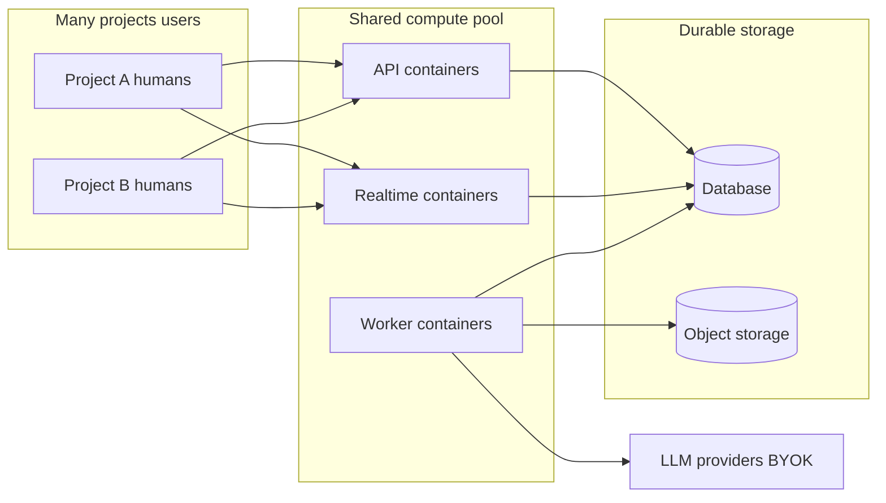
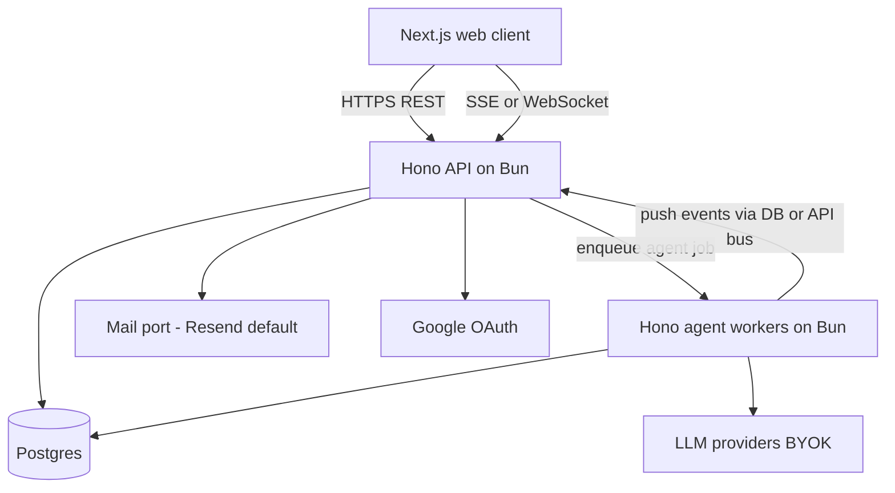
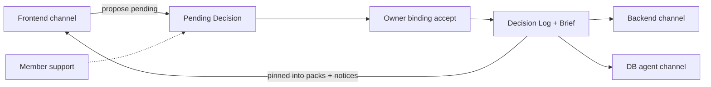
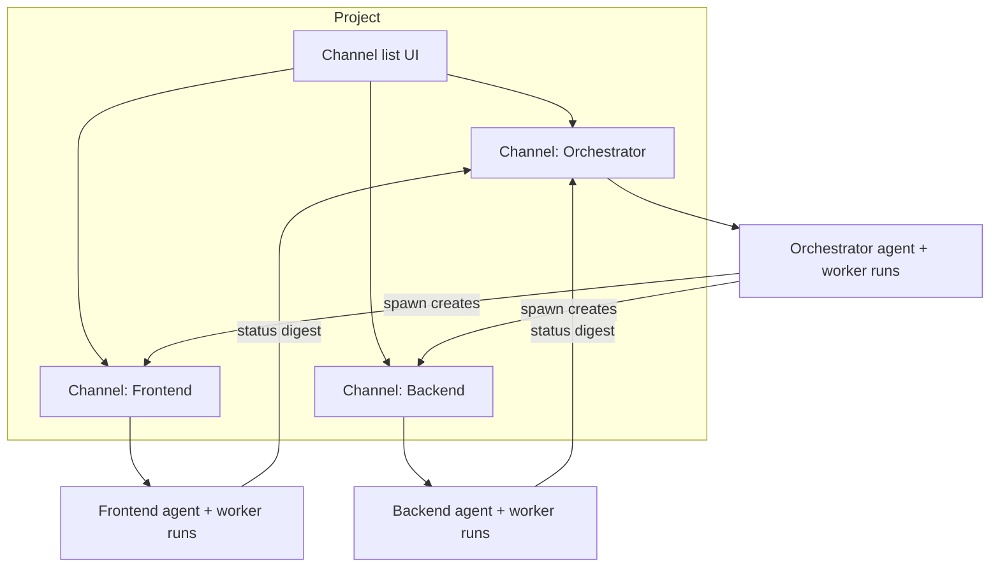
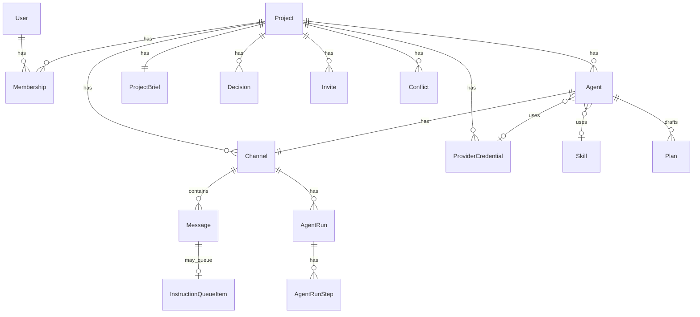
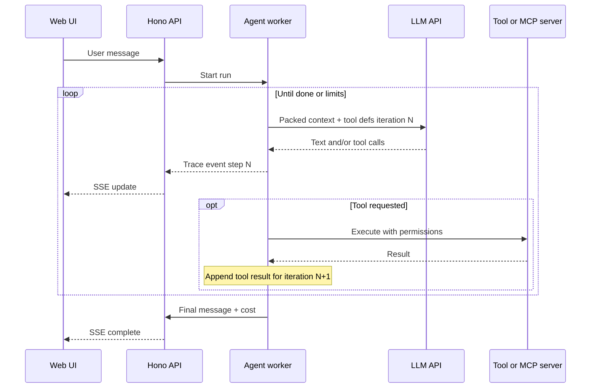

# SOURCE_OF_TRUTH

## 1. Document Metadata


| Field                              | Value                                                                                                                                                                                    |
| ---------------------------------- | ---------------------------------------------------------------------------------------------------------------------------------------------------------------------------------------- |
| Project name                       | Dawk (**Assumption** A-001 — inferred from Git remote; not yet confirmed by owner)                                                                                                       |
| Document purpose                   | Canonical record of requirements, architecture, decisions, feasibility, and open questions for planning. Not an implementation guide for code.                                           |
| Last updated                       | 2026-10-09                                                                                                                                                                               |
| Current planning phase             | **Phase 1 implementation, M11** (queue, Q&A, conflicts, and spend; design remains in this document) |
| Current status                     | Coding authorized for Phase 1 local work from M0 (2026-10-09, ADR-027). IMP-SEC-001 + IMP-Q-002 accepted. M13 still waits on HOST-1. |
| Known limitations of this document | §11 stays conceptual. Phase 1 DDL is `apps/api/migrations` (M1–M2). Project APIs start at M3. Free-tier host vendors intentionally undecided until M13 (no vendor lock-in). |


## 2. Executive Summary


| Aspect                  | Content                                                                                                                                                                                                                                                                                                                         | Classification                    |
| ----------------------- | ------------------------------------------------------------------------------------------------------------------------------------------------------------------------------------------------------------------------------------------------------------------------------------------------------------------------------- | --------------------------------- |
| What the project does   | A multi-user cloud app where teams collaborate with an orchestrator agent and specialized primary agents (and optionally nested agents) on a connected or new codebase. Humans and agents share WhatsApp-like group chats; agent work and plans are visible; humans can interrupt, queue, and resolve conflicting instructions. | **Confirmed** (owner vision)      |
| Who it serves           | Phase-1 beachhead: (1) small friend/dev teams and (2) startup/business product teams collaborating on building a product with AI agents. Education deferred.                                                                                                                                                                    | **Confirmed** (ADR-008)           |
| Problem it solves       | Today one person can run many AI agents in parallel, but teammates cannot observe progress or inject input during that work window.                                                                                                                                                                                             | **Confirmed**                     |
| Value proposition       | Shared, real-time visibility and interaction with a managed agent swarm (orchestrator + specialists), so collaboration continues while agents work — not after the fact. Analogous to Google Docs for documents, but for creating projects live with humans + agents.                                                           | **Confirmed** (intent)            |
| End-state agent outputs | Agents must ultimately produce (1) plans/chat artifacts, (2) documents in the project, and (3) real code changes (edits/tests/commits/PRs in a cloud workspace).                                                                                                                                                                | **Confirmed** (owner, 2026-10-09) |
| Delivery approach       | Step-by-step / phased toward the full end state; not a single big-bang build of all capabilities.                                                                                                                                                                                                                               | **Confirmed** (owner accepts)     |


## 3. Problem Definition and Scope

### Problem statement

**Confirmed:** Individual developers increasingly use multiple AI agents in parallel on a task/project, but other teammates have no shared surface to monitor progress or contribute during that period. Collaboration around agent work is fragmented or asynchronous-after-the-fact.

### Goals (draft — not yet measurable)


| Goal ID | Goal                                                                                                                                               | Classification                   |
| ------- | -------------------------------------------------------------------------------------------------------------------------------------------------- | -------------------------------- |
| G-001   | Let a project owner connect an existing codebase or create a new one, then brief an orchestrator agent.                                            | **Confirmed** desired capability |
| G-002   | Orchestrator acts as team-manager brain: guides senior-level design thinking, decomposes work, spawns specialist primary agents with requirements. | **Confirmed** desired capability |
| G-003   | Primary agents draft plans; user approval starts execution; outputs are visible to the team.                                                       | **Confirmed** desired capability |
| G-004   | Multiple humans can join a project and interact with orchestrator and primary agents (questions, queued change requests, conflict arbitration).    | **Confirmed** desired capability |
| G-005   | WhatsApp-like group chat among humans + agents (orchestrator, frontend, backend, etc.).                                                            | **Confirmed** desired UX         |
| G-006   | Agents may communicate with orchestrator (and among themselves as needed); nested spawn of further primary agents for atomic subtasks.             | **Confirmed** desired capability |
| G-007   | Accessible on web and phones (cloud-hosted).                                                                                                       | **Confirmed** desired capability |
| G-008   | BYOK: users supply API credentials for providers (OpenAI, Claude, Grok, Gemini, etc.); orchestrator picks models by default; users can override.   | **Confirmed** desired capability |
| G-009   | End state is live collaborative project creation (humans + agents), not chat-only theater: plans, in-project documents, and real code changes.     | **Confirmed**                    |
| G-010   | Delivery may be phased; final outcome must still match the full previously stated vision.                                                          | **Confirmed**                    |


### Goals and measurable success criteria

**Release posture:** **MVP** (**Accepted** ADR-009 / Q-002). Reliable enough for real small teams to use weekly with BYOK and shared projects — not a throwaway demo, not enterprise-grade production.

**MVP success criteria — Accepted with amendments** (owner 2026-10-09 → Q-006):


| ID     | Criterion                                                                                                                                                                 | How we’d know                                                                         | Status                                         |
| ------ | ------------------------------------------------------------------------------------------------------------------------------------------------------------------------- | ------------------------------------------------------------------------------------- | ---------------------------------------------- |
| SC-001 | Two or more humans can join one project and participate in the shared agent chat in the same session.                                                                     | Manual test with 2–3 accounts                                                         | **Accepted**                                   |
| SC-002 | Orchestrator produces a structured project plan/brief visible to all members.                                                                                             | Review sample poker-app session                                                       | **Accepted**                                   |
| SC-003 | At least two fixed specialist agents can be present in chat with distinct roles.                                                                                          | Observe separate agent identities/messages                                            | **Accepted**                                   |
| SC-004 | Owner can approve or reject an agent plan; agent does not proceed without approval.                                                                                       | Approval gate test                                                                    | **Accepted**                                   |
| SC-005 | While an agent is “busy,” a Member request is queued (or Q&A handled without corrupting the main task narrative).                                                         | Concurrent-message test                                                               | **Accepted**                                   |
| SC-006 | Contradictory Owner vs Member instructions surface a conflict; only Owner resolution unblocks.                                                                            | Conflict scenario test                                                                | **Accepted**                                   |
| SC-007 | Project Owner connects BYOK; agent turns for that project bill to the **Owner’s** key (ADR-011).                                                                          | End-to-end BYOK test                                                                  | **Accepted** (amended)                         |
| SC-008 | Responsive web usable on phone browser for chat participation (not necessarily full desktop parity).                                                                      | Mobile browser smoke test                                                             | **Accepted**                                   |
| SC-009 | A real small team (friends or early startup) uses it for ≥1 real project planning session and reports they could follow agent progress together.                          | Qualitative pilot                                                                     | **Accepted**                                   |
| SC-010 | Test plan covers **local**, **free/low-cost online**, and **cloud MVP** paths (see §17).                                                                                  | Documented test matrix executed at least once per path before “MVP done”              | **Accepted** (added)                           |
| SC-011 | After multi-day idle, project **chat/plans/agent context** are still restorable; idle does not require keeping paid compute warm (Phase-1).                               | Idle 3+ days, reopen project, history and agent continuity restore from durable store | **Accepted** (added)                           |
| SC-012 | Owner-visible spend controls exist at least as: per-project budget/cap and kill-switch for further LLM calls (Phase-1 minimum); deeper recursive controls before Phase 4. | Cap hit stops calls; Owner can resume                                                 | **Accepted** (added; depth of controls phased) |


### In-scope (end state — confirmed vision)

Treat as **Confirmed end-state** capabilities. Build order is phased; nothing below is dropped from the destination unless the owner later rejects it:

- Live multi-human collaboration on a project (Google Docs analogy for projects)
- Project create/connect codebase
- Orchestrator-led discovery (HLD/LLD, APIs, security, UI/UX, etc.)
- Specialist agents (frontend, backend, security, tester, QA, DevOps; also non-engineering e.g. marketing)
- Plan draft → human approval → execution
- Agent outputs: plans/chat + in-repo documents + real code changes/tests/PRs
- Multi-human collaboration, interruptible Q&A via temporary threads, request queuing
- Contradictory instruction detection and arbitration
- Agent-to-agent communication; recursive agent spawn/delegation
- Multi-provider LLM BYOK + model selection/override
- Web + mobile clients

### Explicitly out-of-scope

**Pending owner confirmation for permanent exclusions.** No end-state items ruled out.

**Temporary deferrals (Proposed delivery order — awaiting approval):** Education productization, marketing agents, recursive spawn depth, and native mobile apps are end-state-capable but should not block Phase 1.

### MVP versus later phases

**Status:** Delivery order **Accepted** (ADR-004 / Q-012). Phase-1 feature freeze **Accepted** (Q-007 / ADR-005).

**Confirmed:** Final product must include plans/chat, in-project docs, and real code mutation — sequenced, not abandoned.

**Accepted product phases (ADR-004):**


| Phase   | Working name             | What humans get                                                                                                         | Agent output level                             | Primary risk reduced                                   |
| ------- | ------------------------ | ----------------------------------------------------------------------------------------------------------------------- | ---------------------------------------------- | ------------------------------------------------------ |
| Phase 1 | Live collab room         | Multi-human + orchestrator (+ optional fixed specialists) WhatsApp-like chat; shared visibility; queue + conflict ask   | Plans/chat artifacts; structured project brief | Proves collaboration thesis without sandbox complexity |
| Phase 2 | Shared project workspace | GitHub OAuth + **repo linking**; connected/new repo visible to team; agents write specs/ADRs/docs into the project      | In-repo documents                              | Proves durable shared artifacts                        |
| Phase 3 | Coding agents            | Cloud workspace; agents edit code, run checks, propose commits/PRs with approval gates                                  | Real code changes                              | Delivers “create projects live”                        |
| Phase 4 | Swarm depth              | Broader specialist roster, controlled A2A, limited nested spawn, model routing polish, mobile hardening, non-eng agents | Full vision                                    | Scale orchestration without chaos                      |


#### Phase 1 in/out — **Accepted** (owner 2026-10-09)

**Glossary:** **BYOK** = Bring Your Own Key. The user supplies their own API keys/credits for LLM providers (OpenAI, Claude, etc.). Dawk calls those providers using the user’s credentials; the platform does not (by default) sell bundled model tokens. Platform still incurs its own hosting costs.

**IN for Phase 1:**


| ID        | Item                                                                                                                                          |
| --------- | --------------------------------------------------------------------------------------------------------------------------------------------- |
| P1-IN-001 | Accounts/signup (see ADR-016); **project Owner** attaches LLM provider key(s) (BYOK); basic project create                                    |
| P1-IN-002 | Invite/join project members (see ADR-016): in-app accept for existing users; email invite link for addresses without an account               |
| P1-IN-011 | Durable project state (messages, plans, agent run metadata, queues, conflicts) survives idle; no always-on per-project VM required in Phase 1 |
| P1-IN-012 | Per-project LLM spend cap / pause further calls (Owner-controlled)                                                                            |
| P1-IN-013 | Documented local + free online + cloud MVP test approach                                                                                      |
| P1-IN-003 | WhatsApp-like UX: channel list + per-agent chat windows (orchestrator + each specialist) |
| P1-IN-004 | Orchestrator guides planning dialogue; produces structured plan/brief in its channel |
| P1-IN-005 | Spawn small fixed specialists — each spawn creates Agent + Channel (FR-035); no recursive spawn |
| P1-IN-006 | All members can open any agent channel; see messages/traces/status |
| P1-IN-007 | Queue human requests while an agent is busy; temporary Q&A thread behavior                                                                    |
| P1-IN-008 | On contradictory instructions, agent pauses and asks which to follow                                                                          |
| P1-IN-009 | Plan draft → explicit human approval before agent continues “execution” (execution = further chat/plan work in Phase 1, not code edits)       |
| P1-IN-010 | Usable in mobile browser (responsive web) — not necessarily native apps                                                                       |


**OUT of Phase 1 (still end-state later):**


| ID         | Item                                                                           | Target phase                                           |
| ---------- | ------------------------------------------------------------------------------ | ------------------------------------------------------ |
| P1-OUT-001 | Agents writing files into a real repo; GitHub OAuth login; GitHub repo linking | Phase 2 (ADR-017)                                      |
| P1-OUT-002 | Code edits, tests, commits/PRs, cloud dev sandboxes                            | Phase 3                                                |
| P1-OUT-003 | Recursive/nested agent spawn                                                   | Phase 4                                                |
| P1-OUT-004 | Free-mesh agent-to-agent chat (beyond orchestrator hub)                        | Phase 4                                                |
| P1-OUT-005 | Marketing/non-eng agents; education productization                             | Phase 4                                                |
| P1-OUT-006 | Native mobile apps                                                             | Phase 4 (or earlier if owner prioritizes)              |
| P1-OUT-007 | Sophisticated auto model-routing across many providers                         | Phase 4 (Phase 1: manual override + simple default OK) |


## 4. Stakeholders and User Personas

**Status:** Draft from owner example; beachhead not confirmed.


| Persona ID                           | Description                                            | Goals                                            | Permissions (draft)                                                                  | Classification                                                                 |
| ------------------------------------ | ------------------------------------------------------ | ------------------------------------------------ | ------------------------------------------------------------------------------------ | ------------------------------------------------------------------------------ |
| P-001 Project creator / owner        | Initiates project, briefs orchestrator                 | Drive product from idea → plan → agent execution | Highest authority: manage members/roles, BYOK, approve plans, final say on conflicts | **Confirmed**                                                                  |
| P-002 Collaborating teammate         | Joins project; asks agents questions; requests changes | Contribute without blocking; stay informed       | Permissions depend on assigned role (Owner vs Member) — see RBAC below               | **Confirmed**                                                                  |
| P-003 Business / non-eng stakeholder | Marketing and similar agents mentioned                 | Unclear for Phase 1                              | Unclear                                                                              | Later phase (agents); business *product teams* are in beachhead as P-001/P-002 |
| P-004 Learner / education user       | Education use case                                     | Learning outcomes                                | Unclear                                                                              | **Deferred** from Phase 1 beachhead (ADR-008)                                  |


**Beachhead framing (Accepted ADR-008):** Design Phase 1 for **small collaborative product teams** (roughly 2–10 people) whether informal friends or an early startup/business squad. Shared needs: shared agent visibility, chat, owner authority, BYOK.

**Deliberately not Phase-1 beachhead:** Education/curriculum product; large enterprise (SSO, SCIM, procurement, complex compliance) — may overlap later with (2) but must not drive Phase 1 scope.

### Access boundaries and RBAC

**Confirmed direction (ADR-006 / Q-009):** Role-based access control. Project **owner has highest priority** (can override other roles on approvals and conflict resolution).

**Phase-1 roles — Accepted (ADR-007 / Q-013):** **Owner + Member only.** Lead role deferred to a later phase.


| Role       | Assign how      | Can chat / queue to agents | Approve agent plans                 | Resolve instruction conflicts            | Manage members & BYOK | Notes                                                       |
| ---------- | --------------- | -------------------------- | ----------------------------------- | ---------------------------------------- | --------------------- | ----------------------------------------------------------- |
| **Owner**  | Project creator | Yes                        | Yes                                 | Yes — **only** role that can resolve     | Yes                   | Exactly one active owner for Phase 1 (**Assumption** A-006) |
| **Member** | Owner invites   | Yes                        | No — can request that owner approve | No — can state preference; cannot decide | No                    | Default teammate                                            |


**Lead role:** **Deferred** (not in Phase 1). May be added later without changing owner supremacy (ADR-006).

**Conflict rules (Accepted for Phase 1):**

1. Agent detects contradictory instructions → posts conflict card in chat naming parties and options.
2. **Only Owner** may choose the winning instruction.
3. Members may argue/prefer in chat; agent does not proceed on Member consensus alone.
4. Audit: record who instructed what and who resolved it (supports NFR-005).

## 5. Requirements

Stable ID conventions: `FR-###`, `NFR-###`, `C-###`, `A-###`, `DEP-###`.

Requirements below are **vision-derived drafts**, not locked MVP requirements. Status column indicates confirmation of intent, not build commitment.

### Functional requirements (draft)


| ID     | Requirement                                                                                                                                                                                                                                     | Classification                                    | MVP?                                   |
| ------ | ----------------------------------------------------------------------------------------------------------------------------------------------------------------------------------------------------------------------------------------------- | ------------------------------------------------- | -------------------------------------- |
| FR-001 | User can create a new project or connect an existing codebase.                                                                                                                                                                                  | **Confirmed** intent                              | Unresolved                             |
| FR-002 | User briefs an orchestrator agent that guides senior-engineer style planning (HLD, LLD, APIs, security, UI/UX, etc.).                                                                                                                           | **Confirmed** intent                              | Unresolved                             |
| FR-003 | Orchestrator decomposes work and spawns specialist primary agents with requirements/system prompts for their aspect.                                                                                                                            | **Confirmed** intent                              | Unresolved                             |
| FR-004 | Primary agent drafts a plan; execution begins only after user approval.                                                                                                                                                                         | **Confirmed** intent                              | Unresolved                             |
| FR-005 | Humans can view orchestrator and primary-agent outputs/progress.                                                                                                                                                                                | **Confirmed** intent                              | Unresolved                             |
| FR-006 | Multiple team members can join a project and interact with orchestrator and primary agents.                                                                                                                                                     | **Confirmed** intent                              | Unresolved                             |
| FR-007 | WhatsApp-like multi-channel chat: one channel per agent; humans talk in that agent’s window; all members can open any channel. | **Confirmed** (ADR-022) | Phase 1 |
| FR-035 | Orchestrator spawn creates specialist Agent + own Channel, seeded with requirements; channel appears in the project list. | **Confirmed** (owner) | Phase 1 |
| FR-036 | Shared Brief + Decision Log; proposals from any channel/agent; **only Owner** accepts into global log; Member accept = non-binding support; change notices on Owner accept; pinned into all agent packs. | **Confirmed** (ADR-023) | Phase 1 |
| FR-037 | Phase 3: shared project workspace (sandbox + persistent volume + git) for all coding agents. | **Confirmed** (ADR-024) | Phase 3 |
| FR-008 | While an agent is busy, a teammate question can be handled via a temporary thread; answer surfaces in the relevant chat window.                                                                                                                 | **Confirmed** intent                              | Unresolved                             |
| FR-009 | Change requests while an agent is working are queueable (e.g. “add animations to home button”).                                                                                                                                                 | **Confirmed** intent                              | Unresolved                             |
| FR-010 | On contradictory human instructions, agent must ask which to follow before proceeding; resolution follows role-based authority with owner highest priority.                                                                                     | **Confirmed** intent                              | Phase 1                                |
| FR-019 | Projects use role-based permissions; owner has highest priority over approvals and conflict resolution.                                                                                                                                         | **Confirmed**                                     | Phase 1                                |
| FR-011 | Agents communicate with orchestrator as needed; agents may communicate among themselves when needed.                                                                                                                                            | **Confirmed** intent                              | Unresolved                             |
| FR-012 | Primary agents may spawn further primary agents and delegate atomic lower-complexity tasks.                                                                                                                                                     | **Confirmed** intent                              | Unresolved                             |
| FR-013 | Product usable on web and phones.                                                                                                                                                                                                               | **Confirmed** intent                              | Unresolved                             |
| FR-014 | Onboarding allows attaching API keys for chosen LLM providers; multiple providers supported over time.                                                                                                                                          | **Confirmed** intent                              | Phase 1 (Owner keys)                   |
| FR-015 | Default model routing may suggest a model; **Owner** can override per project and **per agent** (provider + model). | **Confirmed** (expanded ADR-026) | Phase 1 |
| FR-020 | Project LLM calls use the **Owner’s** credentials only (not Member keys). Owner may store **multiple** provider credentials on the project. | **Confirmed** (ADR-011 + ADR-026) | Phase 1 |
| FR-038 | Owner can set a **primary** credential and **fallback** credential(s) / manually select which credential to use when primary fails or is marked exhausted. | **Confirmed** (ADR-026) | Phase 1 |
| FR-039 | Owner can assign different provider/model (among their attached credentials) to different agents (e.g. Orchestrator=Claude, Frontend=Gemini, Backend=OpenAI). | **Confirmed** (ADR-026) | Phase 1 |
| FR-025 | Users can sign up / log in with email **password**, email **magic link**, and Google OAuth.                                                                                                                                                     | **Confirmed** (ADR-016/019)                       | Phase 1                                |
| FR-029 | Authenticated users can change their account email via a verified flow (confirm control of account / new address as designed in LLD).                                                                                                           | **Confirmed** intent (owner 2026-10-09)           | Phase 1                                |
| FR-030 | Agent activity is visible beyond final answers: members can see run status, assumptions, stepwise progress, model identity, and cost/token usage for a turn; tool/command traces when tools exist (Phase 3+).                                   | **Confirmed** intent (owner 2026-10-09)           | Phase 1 (core trace); tools in Phase 3 |
| FR-031 | Agent LLM turns use packed context (summary + pins + recent/relevant window), not full-history replay by default. | **Confirmed** (ADR-020) | Phase 1 |
| FR-032 | Server-side multi-iteration agent loops with streamed traces; bounded by max steps, time, spend. | **Confirmed** (ADR-021) | Phase 1 |
| FR-033 | Skills as versioned playbook packs; Phase 1 simple prompt/config skills. | **Confirmed** (ADR-021) | Phase 1 |
| FR-034 | MCP/tool gateway planned for coding phase; not required for Phase 1. | **Confirmed** (ADR-021) | Phase 3 |
| FR-026 | Project Owner can invite Members: (a) existing user gets in-app invite to accept/decline; (b) email address without account receives invite email; accepting completes signup (if needed) and joins as Member.                                  | **Confirmed** (ADR-016)                           | Phase 1                                |
| FR-027 | GitHub OAuth login and GitHub repo linking ship in Phase 2 together with shared workspace/docs-in-repo.                                                                                                                                         | **Confirmed** (ADR-016/017)                       | Phase 2                                |
| FR-028 | Phase 1 transactional email (invites) sent via Resend by default, behind an abstract mail port; SMTP remains a supported alternative transport.                                                                                                 | **Confirmed** (ADR-018)                           | Phase 1                                |
| FR-021 | Project conversational state, plans, queues, conflicts, and agent run records are stored durably by the platform; they must not depend on an API key remaining unchanged or on a compute instance staying warm.                                 | **Confirmed** intent (from idle/context concerns) | Phase 1                                |
| FR-022 | Owner can set a per-project spend cap (and pause/resume LLM calls) to prevent runaway BYOK charges.                                                                                                                                             | **Confirmed** intent                              | Phase 1 minimum                        |
| FR-023 | Before recursive/nested agents ship: hard limits on spawn depth, concurrent agents, and per-run/per-day spend; optional Owner approval for spawn.                                                                                               | **Confirmed** intent for later                    | Phase 4 gate                           |
| FR-024 | Later phases: support multiple credentials on a project (e.g. Owner + employee/org keys) when required, without losing project context on key rotate/swap — context remains platform-owned (ADR-012). Phase 1 remains Owner-key-only (ADR-011). | **Confirmed** (owner 2026-10-09)                  | Post–Phase 1                           |
| FR-016 | Specialist roster may include frontend, backend, security, tester, QA, DevOps, and non-engineering roles (e.g. marketing).                                                                                                                      | **Confirmed** intent                              | Unresolved                             |
| FR-017 | End-state agent work produces plans/chat artifacts, documents committed into the project, and real code changes (file edits, commands/tests as needed, commits/PRs) in a shared cloud-accessible project.                                       | **Confirmed** end state                           | Phased (not all in Phase 1)            |
| FR-018 | Multiple humans can collaborate on the same live project session concurrently (Google Docs-like co-presence for project creation).                                                                                                              | **Confirmed** intent                              | Unresolved phase mapping               |


### Non-functional requirements (draft — targets mostly pending)


| ID      | Requirement                                                                                                                                                                                      | Classification                                             |
| ------- | ------------------------------------------------------------------------------------------------------------------------------------------------------------------------------------------------ | ---------------------------------------------------------- |
| NFR-001 | Multi-user real-time visibility of agent activity (latency targets TBD).                                                                                                                         | **Confirmed** intent; metrics **Pending**                  |
| NFR-002 | Cloud-hosted agent runtime (“cloud cluster of agents”) including, by end state, execution environment capable of code mutation — not LLM chat sessions alone.                                    | **Confirmed** end-state intent; infra shape **Unresolved** |
| NFR-003 | Secure handling of user-provided LLM API keys.                                                                                                                                                   | **Implied** / **Proposed** must-have                       |
| NFR-004 | Cost control for parallel LLM calls (Phase 1) and recursive spawn (Phase 4): caps, depth limits, kill-switch.                                                                                    | **Confirmed** intent                                       |
| NFR-005 | Auditability of who instructed what, and which instruction won a conflict.                                                                                                                       | **Proposed**                                               |
| NFR-006 | Platform cost control: do not keep dedicated warm compute per idle project in Phase 1; scale shared app tier. Phase 3 sandboxes must hibernate/release on idle while preserving workspace state. | **Confirmed** intent                                       |
| NFR-007 | Testability across local, free/low-cost hosted, and paid cloud MVP environments.                                                                                                                 | **Confirmed** intent                                       |


### Constraints


| ID    | Statement                                                                                                                                                           | Classification                              |
| ----- | ------------------------------------------------------------------------------------------------------------------------------------------------------------------- | ------------------------------------------- |
| C-001 | Planning session prohibits implementation code, executable infra configs, migrations, and scaffolding until the owner explicitly lifts the constraint.              | **Confirmed**                               |
| C-002 | Workspace `d:\dawk` currently contains no application source or prior docs; Git remote `git@github.com:akshatnavlani/Dawk.git`, no commits at planning start.       | **Confirmed**                               |
| C-003 | LLM inference cost is intended to be borne primarily via user-supplied provider credentials (**BYOK** = Bring Your Own Key). Platform hosting/runtime cost remains. | **Confirmed** (BYOK intent)                 |
| C-004 | MVP plan must accommodate local testing, free/low-cost online testing, and real cloud MVP deployment.                                                               | **Confirmed** (owner)                       |
| C-005 | Idle projects must not burn meaningful platform cost; user state/context must remain recoverable after multi-day absence.                                           | **Confirmed** (owner)                       |
| C-006 | Engineering team size for build: **2 people**.                                                                                                                      | **Confirmed** (owner 2026-10-09)            |
| C-007 | Phase 1 timeline: **no hard deadline** (“as long as it takes”).                                                                                                     | **Confirmed** (owner 2026-10-09)            |
| C-008 | Initial hosting and testing must be **free** (or free-tier). Paid/proper hosting budget decided after first real users.                                             | **Confirmed** (owner 2026-10-09)            |
| C-009 | No current vendor lock-in requirement; preference to **avoid** unnecessary lock-in.                                                                                 | **Confirmed** (owner 2026-10-09)            |
| C-010 | Team strongest skills: Next.js, Tailwind, TypeScript, Bun, Hono, Postgres, Zod, web3, FastAPI, MongoDB, Redis.                                                      | **Confirmed** (owner 2026-10-09; Zod added) |


### Assumptions


| ID    | Statement                                                                                                                                                 | Classification                                                                  |
| ----- | --------------------------------------------------------------------------------------------------------------------------------------------------------- | ------------------------------------------------------------------------------- |
| A-001 | Project name is “Dawk”.                                                                                                                                   | **Assumption**                                                                  |
| A-002 | This repository is intended to hold the product under discussion.                                                                                         | **Assumption**                                                                  |
| A-003 | “Connect existing codebase” implies read/write agent access to project files in some hosted workspace by end state (not permanently chat-only).           | **Confirmed** for end state (via Q-008 answer); Phase-1 may still be chat-first |
| A-004 | Plan approval is required per primary agent plan (not only once at orchestrator level).                                                                   | **Assumption** from wording                                                     |
| A-005 | Conflict resolution defaults to asking humans in chat; no automatic merge of contradictory instructions.                                                  | **Confirmed**                                                                   |
| A-006 | Phase 1 has a single project owner at a time (ownership transfer may be later).                                                                           | **Assumption**                                                                  |
| A-007 | “Free hosting” means public free tiers / free plans of managed services (or fully local), accepting cold starts, sleep, and low limits until first users. | **Assumption**                                                                  |


### Dependencies


| ID      | Dependency                                                                                        | Classification                           |
| ------- | ------------------------------------------------------------------------------------------------- | ---------------------------------------- |
| DEP-001 | Third-party LLM APIs (OpenAI, Anthropic/Claude, xAI/Grok, Google Gemini, others TBD).             | **Confirmed** intent                     |
| DEP-002 | Code hosting / workspace mechanism for connected or new codebases (Git provider, cloud FS, etc.). | **Unresolved**                           |
| DEP-003 | Real-time messaging transport for multi-user chat and agent status.                               | **Implied**                              |
| DEP-004 | Google OAuth application credentials.                                                             | **Confirmed** need (ADR-016)             |
| DEP-005 | Transactional email: Resend (default) and/or SMTP behind mail port.                               | **Confirmed** (ADR-018)                  |
| DEP-006 | GitHub OAuth App + repo access scopes (Phase 2).                                                  | **Confirmed** need for Phase 2 (ADR-017) |


### Conflicts and unresolved requirements


| ID    | Conflict / tension                                                                                                                                  | Notes                                                                                                                                                   |
| ----- | --------------------------------------------------------------------------------------------------------------------------------------------------- | ------------------------------------------------------------------------------------------------------------------------------------------------------- |
| X-001 | Broad audiences (dev teams, businesses, education) vs single coherent MVP.                                                                          | Partially resolved: education deferred; 1+2 unified as small product teams. Residual: business may later demand enterprise features Phase 1 won’t have. |
| X-002 | Recursive agent spawn (FR-012) vs cost, observability, and reliability (NFR-004).                                                                   | Partially addressed by FR-023 + Phase 4 deferral; caps still to specify numerically                                                                     |
| X-003 | Free-form multi-human instruction to any agent vs coherent execution and approval gates (FR-004 vs FR-009/FR-010).                                  | Mitigated for Phase 1 by Owner-only approval/conflict (ADR-007)                                                                                         |
| X-004 | End state requires code-execution sandboxes; Phase 1 may not. Designing only for Phase 3 early overbuilds; designing never for Phase 3 underbuilds. | Sequence via phases; idle policy differs by phase (ADR-010)                                                                                             |
| X-005 | “Project uses Owner key only” vs startups giving employees individual Claude accounts/keys.                                                         | Owner key = Phase 1 (ADR-011). Multi-key / employee billing = later (FR-024, Q-015). Context must not live in the key.                                  |


## 6. Feasibility Analysis

Feature-level classifications are provisional pending MVP cut and Q-008.


| Feature / capability                                                          | Feasibility                                                                        | Evidence / reasoning                                                                                                                                                                          | Verification needed                                          |
| ----------------------------------------------------------------------------- | ---------------------------------------------------------------------------------- | --------------------------------------------------------------------------------------------------------------------------------------------------------------------------------------------- | ------------------------------------------------------------ |
| Multi-user chat + shared transcript of agent messages                         | **Feasible**                                                                       | Standard real-time app pattern; not agent-specific.                                                                                                                                           | Product UX only                                              |
| Orchestrator chat that guides planning (HLD/LLD discussion)                   | **Feasible with constraints**                                                      | LLMs can facilitate structured planning; quality and consistency vary; not a substitute for verified architecture without human judgment.                                                     | Prompt/eval experiment later                                 |
| Spawning specialist “roles” as separate agent sessions with different prompts | **Feasible with constraints**                                                      | Common multi-agent pattern; coordination and shared context are hard; more agents ≠ better outcomes.                                                                                          | Define max agents, shared state                              |
| Human approval of plans before execution                                      | **Feasible**                                                                       | Workflow/state machine; deterministic.                                                                                                                                                        | Clarify who may approve (Q-009)                              |
| Queueing human requests while agent works                                     | **Feasible with constraints**                                                      | Requires clear job/queue semantics and interruption policy.                                                                                                                                   | Spec interrupt vs finish-current-step                        |
| Temporary Q&A thread while agent busy                                         | **Feasible with constraints**                                                      | Needs isolation so Q&A does not corrupt in-flight task state.                                                                                                                                 | Design memory/tool boundary                                  |
| Contradictory instruction detection                                           | **High risk**                                                                      | LLMs may miss contradiction or invent false conflicts; needs explicit instruction ledger + rules, not vibe.                                                                                   | Define contradiction model                                   |
| Agent-to-agent messaging                                                      | **Feasible with constraints**                                                      | Easy to implement, hard to keep useful; risk of chatter, loops, cost.                                                                                                                         | Caps, protocols, when allowed                                |
| Recursive primary-agent spawn                                                 | **High risk**                                                                      | Cost explosion, loss of oversight, cascading failures; often worse than a flat task queue under orchestrator.                                                                                 | Strong justification or defer                                |
| Actual code changes / tests / DevOps in cloud                                 | **High risk** for early phases; **Unverified** at production quality for end state | Required by end state (FR-017). Depends on sandbox, git, secrets, long-running jobs, tool permissions. Feasible in principle (existing coding-agent products), hard to make multi-human-safe. | After Phase-1 cut: sandbox/git spike with pass/fail criteria |
| BYOK multi-provider + auto model routing                                      | **Feasible with constraints**                                                      | Key storage/security is hard; “best model” routing is heuristic unless evaluated; provider APIs differ.                                                                                       | Provider capability matrix                                   |
| Non-engineering agents (marketing)                                            | **Feasible** as chat personas; weak unless tied to concrete tools/outputs          | Likely distracts from core thesis early.                                                                                                                                                      | Defer recommended                                            |
| Web + mobile                                                                  | **Feasible with constraints**                                                      | Dual clients increase cost; responsive web may suffice initially.                                                                                                                             | Confirm mobile native vs responsive (Q-010)                  |
| Education / production-grade teaching product                                 | **Unverified** as a product line                                                   | Different UX, curriculum, assessment — not the same as collab agent room.                                                                                                                     | Separate phase                                               |


### Required experiments (describe only; not implementing)


| Experiment      | Purpose                                                                                                               | Pass/fail idea                                                   |
| --------------- | --------------------------------------------------------------------------------------------------------------------- | ---------------------------------------------------------------- |
| EXP-001         | End-state output levels confirmed (all three). Remaining: choose Phase-1 cut (Q-012).                                 | Owner decision on sequencing                                     |
| EXP-002 (later) | Manual dry-run of poker example with 2 humans + scripted “agents” (no real swarm) to validate chat/queue/conflict UX. | Humans can follow status and resolve conflicts without confusion |


## 7. System Context and High-Level Architecture

**Status:** Phase-1 HLD **Accepted** (ADR-025 / Q-023). Detail design (flows, APIs, schema) next.

### Phase-1 technology choices (ADR-015 — **Accepted**)


| Layer           | Choice                                       | Why                                                                            | Explicitly not now            |
| --------------- | -------------------------------------------- | ------------------------------------------------------------------------------ | ----------------------------- |
| Web UI          | Next.js + Tailwind + TypeScript              | Team strength; fits chat/settings UX; responsive web (P1-IN-010)               | Native apps                   |
| API / workers   | Hono on Bun                                  | Team strength; REST + agent job handlers; UI/API separation                    | FastAPI (two languages)       |
| Primary DB      | Postgres                                     | Relational fit; team strength; free-tier options                               | Mongo as second primary DB    |
| Validation      | **Zod**                                      | Team skill; shared schemas for API I/O, env config, and structured LLM outputs | Ad-hoc `typeof` checks        |
| Cache / pub-sub | None required day-one                        | Extra free-tier moving part                                                    | Redis until proven necessary  |
| Agents / LLM    | TypeScript from Hono workers + provider SDKs | Same language; Owner BYOK                                                      | Separate Python agent service |
| Web3            | Out of Phase 1                               | Unrelated to collab-agent MVP                                                  | Any chain integration         |


**Zod verdict:** **Yes — use it in Phase 1.** Low cost, high leverage for request/response validation, invite/auth payloads, and parsing model JSON into typed plan/conflict objects. Fits the TS/Hono/Next stack cleanly.

**Hosting:** **Local first** (IMP-Q-001 option 3 accepted 2026-10-09). Friend testing via local/tunnel during M0–M12. Free-tier vendors chosen via HOST-1 before deploy milestone M13. Paid upgrade path later (ADR-014).

### Phase-1 auth & invites (ADR-016 — **Accepted**)


| Capability                                                | Phase 1?    | Status                 | Rationale                                              |
| --------------------------------------------------------- | ----------- | ---------------------- | ------------------------------------------------------ |
| Email signup/login via **password and magic link** (both) | **In**      | **Accepted** (ADR-019) | Redundant login paths; supports recovery workflows     |
| Change email (verified)                                   | **In**      | **Accepted** intent    | User can update email after proving control of account |
| Google OAuth signup/login                                 | **In**      | **Accepted**           | Fast onboarding for beachhead                          |
| GitHub OAuth signup/login                                 | **Phase 2** | **Accepted** deferral  | Planned with repo linking (ADR-017)                    |
| GitHub **repo linking**                                   | **Phase 2** | **Accepted**           | With docs-in-repo phase (ADR-017)                      |
| Invite existing user → in-app accept/decline              | **In**      | **Accepted**           | Multi-human thesis                                     |
| Invite by email if no account → mail → signup → join      | **In**      | **Accepted**           | Needs mail provider (ADR-018)                          |
| Role on join                                              | Member      | **Accepted**           | ADR-007                                                |


### Email provider: Resend vs SMTP (ADR-018 — **Accepted**)


| Option     | Role                                                               |
| ---------- | ------------------------------------------------------------------ |
| **Resend** | Phase 1 **default** for invite (and optional magic-link) email     |
| **SMTP**   | Supported **fallback** via thin mail port; not personal Gmail SMTP |


**MAIL-1 (2026-10-10):** Resend's free plan is 3,000 transactional emails per month and 100 per UTC day (00:00–24:00 UTC, not a rolling window). Sent and received messages count, and each To, Cc, or Bcc recipient counts separately. The free plan includes 3 verified domains. Checked against [resend.com/pricing](https://resend.com/pricing) and the [account quotas](https://www.resend.com/docs/knowledge-base/account-quotas-and-limits) page. A custom domain must be verified before `MAIL_FROM` can use it. Until then, Resend only allows its onboarding from-address, and only to the account owner's own inbox. Live send with a real key is unverified in this milestone.

### Durable state vs ephemeral runtime (ADR-010)


| Layer                                     | What it holds                   | When it runs                                              | Idle 3 days                                     |
| ----------------------------------------- | ------------------------------- | --------------------------------------------------------- | ----------------------------------------------- |
| **Durable platform state**                | See entity list below           | DB + object storage (always)                              | **Kept** (cheap)                                |
| **Shared multi-tenant compute** (Phase 1) | Explained below                 | Shared servers/containers; work only when requests arrive | **No per-project machine**                      |
| **LLM calls** (BYOK)                      | Inference only                  | On-demand turns                                           | **None** while idle                             |
| **Coding sandbox** (Phase 3)              | Dev environment + project files | Allocated when coding active                              | **Hibernate/release** — **Accepted** (ADR-010a) |


#### What “multi-tenant compute” means (plain infra terms)

**Not** “each project gets its own always-on server.”  
**Means:** many projects/users share the same running application fleet; isolation is by **data and auth**, not by dedicating a VM per project.


| Resource              | Single-tenant (avoid in Phase 1)         | Multi-tenant (proposed Phase 1)                                                                     |
| --------------------- | ---------------------------------------- | --------------------------------------------------------------------------------------------------- |
| **Server / VM**       | One VM per project, always on            | A small pool of VMs (or a managed platform) shared by everyone                                      |
| **Container**         | One long-lived container/pod per project | Shared containers for API, realtime, and workers; each request carries `project_id` / user identity |
| **CPU/RAM**           | Reserved even when idle                  | Used only while handling HTTP/websocket or an agent job; idle projects use ~0                       |
| **Storage (durable)** | Could be on that VM’s disk (fragile)     | Central **database** + **object storage** shared service, rows/objects keyed by project             |
| **Network**           | Per-project endpoints                    | One app URL; tenancy enforced in software                                                           |





**Example:** Project A and Project B both hit the same API containers. When someone in A sends a chat message, a **worker** loads A’s history from the DB, calls the Owner’s LLM key, writes the reply back to the DB, and pushes an event on realtime. When A is idle for 3 days, **no container is “Project A’s machine”** — A’s data simply sits in storage until the next request.

**Phase 3 contrast:** coding work needs an isolated filesystem/toolchain. That **does** look more like “an instance”: allocate a sandbox container/VM (+ volume), work, then **hibernate/release** the compute and keep the volume/snapshot/git so the next session restores files (ADR-010a **Accepted**).

#### Durable project state — what we store and why


| Data                                         | Why store it                                                                | If we didn’t                                |
| -------------------------------------------- | --------------------------------------------------------------------------- | ------------------------------------------- |
| **Users & auth**                             | Login, identity                                                             | No accounts                                 |
| **Projects**                                 | Named workspace for a product effort                                        | Nowhere to collaborate                      |
| **Membership + roles**                       | Owner vs Member (ADR-007)                                                   | No permissions                              |
| **Owner BYOK credentials** (encrypted, many) | Multi-provider Owner keys + routing (ADR-011/026)                           | Can’t call models / unsafe key handling     |
| **Channels**                                 | One chat window per agent                                                   | Specialists dumped into one messy thread    |
| **Messages / chat transcript**               | Per-channel history + traces; audit                                         | Lose collaboration record on idle           |
| **Plans + approval status**                  | Gate execution (FR-004)                                                     | Agents proceed without consent or lose plan |
| **Instruction queue**                        | Member requests while agent busy                                            | Lost interrupts                             |
| **Conflicts + resolutions**                  | Owner picks winning instruction; audit                                      | Ambiguous agent behavior; no accountability |
| **Agent definitions / roles**                | Orchestrator vs frontend vs backend identities                              | Specialists not durable across sessions     |
| **Agent run records**                        | Status, costs, errors, which model/key used                                 | Can’t resume, debug, or enforce spend caps  |
| **Summaries / memory pointers**              | Compact context for next LLM turn without re-sending entire history forever | Context loss or unbounded token bills       |
| **Project Brief + Decision Log**             | Cross-agent shared truth (ADR-023)                                          | Specialists invent incompatible realities   |
| **Spend counters / caps**                    | FR-022 cost control                                                         | Runaway Owner bills                         |
| **Attachments / artifacts** (object storage) | Diagrams, exported briefs, later repo snapshots                             | Large blobs don’t belong in DB rows         |


**Phase 2+ additions (not Phase 1 mandatory):** repo metadata, file blobs/docs in project, git refs.  
**Phase 3 additions:** sandbox volume/snapshot IDs, hibernation status, last-active timestamps.

**Principle (ADR-012):** this durable set is the source of truth for “what the agents know.” Provider API keys are **credentials**, not storage.

### Phase-1 HLD — component view (**Draft**)




| Component          | Responsibility                                                                                                                               | Notes                                          |
| ------------------ | -------------------------------------------------------------------------------------------------------------------------------------------- | ---------------------------------------------- |
| **Next.js client** | Auth UI, project list, WhatsApp-like chat, plan approval, invite UI, BYOK settings (Owner), spend cap UI                                     | Tailwind; Zod-validated forms                  |
| **Hono API**       | Auth sessions, projects, membership, invites, messages, plans, conflicts, queues, BYOK key management (encrypt at rest), spend counters      | Multi-tenant; authorize Owner vs Member        |
| **Agent workers**  | Run orchestrator/specialist turns; load durable context; call LLM with Owner key; write messages/plans/runs; respect caps and approval gates | Same Bun/TS codebase as API or sibling service |
| **Postgres**       | All durable Phase-1 state (see inventory above)                                                                                              | Single primary store                           |
| **Mail port**      | Send invite (and optional magic-link) email                                                                                                  | Resend impl; SMTP impl later                   |
| **Google OAuth**   | Signup/login                                                                                                                                 | Phase 1                                        |
| **LLM providers**  | Inference only                                                                                                                               | Owner BYOK; no context ownership               |


**Trust boundaries:** Browser is untrusted. API enforces authZ. BYOK secrets never sent to client in full after save (show masked). Workers access decrypted keys only in server memory for a call. LLM providers receive prompts — treat repo/user content as untrusted for injection (Phase 1 chat-only still relevant).

**Realtime (draft):** Prefer **SSE** from Hono for Phase 1 (simpler on free tiers than sticky websocket fleets). Fallback: short polling. Revisit WebSocket if UX demands it. SSE events are scoped by `project_id` + `channel_id`.

### Per-agent chat windows — Channels model (ADR-022 — **Accepted**)

**Product shape (WhatsApp-like):**

| UI element | Behavior |
| --- | --- |
| **Channel list** (left) | Orchestrator + each spawned specialist (name, status: idle/working/awaiting approval, unread) |
| **Active channel** (main) | Messages + run traces for **that** agent only; humans post here to talk to that agent |
| **Project create** | Creates project + **Orchestrator** agent + its channel automatically |
| **Orchestrator spawns specialist** | Creates `Agent` row + `Channel` row; posts spawn brief/requirements as first system/orchestrator message in the new channel; channel appears for all members |

**Data (conceptual):**

| Entity | Role |
| --- | --- |
| Project | Container |
| Agent | Orchestrator or specialist; skill pack; status; model prefs |
| Channel | 1:1 with an Agent in Phase 1 (`project_id`, `agent_id`) |
| Message | Belongs to `channel_id`; author = user or agent; may reference `run_id` |
| AgentRun | Loop execution; events/traces attached; tied to channel/agent |

**Context packing per channel:** Each agent’s packed context prefers **its channel history** + project-level pins/summary — not every other specialist’s full transcript (controls tokens; specialists stay focused). Orchestrator may receive compact status digests from specialists (hub-and-spoke), not full mesh chat dumps.

**Cross-agent communication (Phase 1):** Prefer orchestrator-mediated: specialist completes → summary message to orchestrator channel (system or agent-authored). Humans can still open any channel directly. No free-mesh specialist↔specialist chat in Phase 1 (aligns ADR-002/021).

### Shared project knowledge — fixing “Frontend invented dark mode, Backend never heard” (ADR-023 — **Accepted**)

**Problem:** Channel isolation is good for focus/tokens, but specialists can invent requirements the others never see if the only memory is per-channel chat.

**Fix: a project-level source of truth all agents read** — not free-mesh chat.

| Piece | Role |
| --- | --- |
| **Project Brief** | Living structured summary: goals, scope, APIs, entities, UX decisions, open questions |
| **Decision Log** | Append-only **accepted** decisions with who proposed, who accepted, when |
| **Pending Decision** | Proposed but not yet global; visible; awaiting Owner |
| **Change notices** | On accept: digest into impacted agent channels + orchestrator; optional “review impact” queue |

#### Who can propose? Where?

| Actor | Can propose a Decision? | Where |
| --- | --- | --- |
| Human (Owner or Member) | **Yes** | Any channel (Orchestrator, Frontend, …) or a project Decisions UI |
| Specialist agent (e.g. Frontend) | **Yes** | Typically its own channel (structured “propose_decision” action in the run) |
| Orchestrator | **Yes** | Its channel, often after synthesizing specialist input |

Proposing in the **Frontend channel is first-class and expected.** It does **not** need to be typed in the Orchestrator channel first. The proposal becomes a **Pending Decision** linked to the project (and shown in Orchestrator + originating channel).

#### Who can accept into global truth?

| Actor | “Accept” means | Becomes Decision Log / Brief? |
| --- | --- | --- |
| **Owner** | Binding accept (or reject) | **Yes** if Owner accepts |
| **Member** | **Support / acknowledge** (“I agree”) — non-binding | **No** |
| **Frontend agent** | Can only **propose** (or suggest) | **No** — agents never self-promote to global truth |
| **Orchestrator** | May **recommend** accept and draft Brief wording | **No** binding accept in Phase 1 without Owner (keeps ADR-007) |

**Theme example (your questions):**

1. Light/dark discussed in **Frontend** channel.  
2. **Frontend agent proposes** Decision: “App supports light + dark theme” → status **Pending** (visible project-wide / in Decisions list + Orchestrator).  
3. If a **Member** clicks accept → recorded as **Member support** only; still Pending; Owner is notified.  
4. **Owner** accepts → Decision Log + Brief update → change notices to Backend, DB, Orchestrator, etc.  
5. Those agents’ next packs include the decision.

**If proposed only in Orchestrator:** same Pending → Owner accept → notices. Origin channel doesn’t matter for authority; only Owner accept does.

**Blunt rule:** Channel chat and Member agreement are **not** global truth. Only **Owner-accepted** decisions are. Otherwise any Member+agent pair could rewrite the product.



### Phase-3 filesystem / git workspace (ADR-024 — **Accepted**)

**Not Phase 1.** When agents work on real files later:

| Need | Approach |
| --- | --- |
| Isolated compute | **Container sandbox** per project workspace (Docker is a strong default for a 2-person team; alternatives exist — Fly machines, Firecracker, etc.) |
| Persistent files | **Volume / disk** attached to that workspace — survives hibernate/release (ADR-010a) |
| Git | Clone/fetch inside the workspace; agents use git tools under policy; one shared tree for the project |
| Multi-agent file access | **One shared project workspace** — Frontend/Backend/DB agents all see the same filesystem (plus Brief). Do not give each agent a secret disconnected disk or they’ll diverge |
| Safety | No host Docker socket to the model; allowlisted commands; network egress controls; Owner approval for risky ops |

**Docker specifically:** **Yes, reasonable default** for Phase 3 — container + volume + git is the usual shape. Exact engine (Docker vs nerdctl vs managed sandbox product) can be chosen at Phase 3 design time; the **architecture commitment** is “isolated sandbox + persistent volume + shared project tree,” not a brand name.

**Phase 1 analogue of the shared filesystem:** the **Brief/Decision Log** (shared knowledge). Phase 3 adds shared **bytes on disk**.



**Out of Phase-1 HLD:** GitHub, repo filesystem, sandboxes, Redis, recursive spawn, free-mesh A2A.

## 8. Component Specifications

**Status:** Skeleton aligned to Phase-1 HLD draft. Detailed LLD pending.


| Component   | Inputs                            | Outputs             | Failure behavior (draft)                                                    |
| ----------- | --------------------------------- | ------------------- | --------------------------------------------------------------------------- |
| API         | Authed HTTP; OAuth callbacks      | JSON; SSE events    | 4xx validation; 401/403 authZ; 429 spend/rate                               |
| Worker      | Jobs: agent_turn, maybe summarize | DB writes; events   | Retry transient LLM errors; mark run failed; never spend past cap           |
| Mail port   | Invite payloads                   | Provider message id | Surface invite-pending if send fails; allow Owner resend                    |
| Next client | User actions                      | Calls API           | Show offline/reconnect; don’t invent agent state locally as source of truth |


## 9. User Flows and Business Processes

**Status:** Phase-1 primary flows **Accepted** (Track A / Q-029). Nested agent spawn is **out of Phase 1** (Phase 4).

### Phase E design track map

| Track | Focus | Loops & skills? |
| --- | --- | --- |
| **A — User flows** | What humans/agents do end-to-end | **Touched lightly:** UF-005/007/009 assume a worker run/loop and traces; skills not a separate user journey |
| **B — Data model** | Postgres entities/relationships | **Yes (structure):** `Skill`, `Agent.skill_id`, `AgentRun`, `AgentRunStep` / iteration events, packed-summary fields |
| **D — Agent runtime LLD** | How the worker executes | **Primary home:** loop algorithm, max steps, tool hooks later, skill load/inject, context packing, trace emission, Q&A vs main run |
| **C — API contracts** | Hono HTTP/SSE | **Yes (surface):** start/cancel run, SSE event shapes, list skills (if configurable), plan/decision payloads |

**Recommendation (accepted sequencing refined):** A → **B** → **D** → **C**.  
APIs (C) should follow runtime LLD (D) so SSE/run endpoints match the loop. Skills/loops were already decided at HLD (**ADR-021**); Tracks B/D/C make them buildable.

### Poker app narrative (illustrative — Phase 1 slice)

Owner creates project → briefs Orchestrator → planning in Orchestrator channel → Owner accepts key Decisions into Brief → Orchestrator spawns Frontend/Backend channels → each drafts a plan → Owner approves → friend joins via invite → friend queues a Frontend request / proposes a Decision → Owner accepts Decision → Backend gets notice. (No nested spawn, no git/sandbox.)

---

### UF-001 — Sign up / log in

| | |
| --- | --- |
| **Goal** | Create session |
| **Preconditions** | None |
| **Happy path** | Email+password signup/login **or** magic-link email **or** Google OAuth → session cookie/token → home |
| **Frontend** | Auth screens; Zod-validated forms |
| **Backend** | Create/find user; issue session; magic link via Resend |
| **Failure** | Invalid credentials; OAuth cancel; magic link expired/used → clear errors; allow retry |
| **Alt** | Change email (FR-029): verified flow while authenticated |

### UF-002 — Create project + attach BYOK

| | |
| --- | --- |
| **Goal** | Owner starts a project ready for agents |
| **Preconditions** | Authenticated |
| **Happy path** | Create project → system creates Orchestrator **Agent + Channel** → Owner adds provider API key(s) (encrypted) → optional spend cap → open Orchestrator channel |
| **AuthZ** | Creator becomes **Owner** |
| **Failure** | Key validation fail (optional probe); storage error → project may exist without usable key; block agent runs until key OK |

### UF-003 — Invite Member (existing user)

| | |
| --- | --- |
| **Goal** | Add teammate who already has an account |
| **Preconditions** | Actor is Owner |
| **Happy path** | Owner invites by email/username → invitee sees in-app invite → Accept → Membership(Member) → can open all channels |
| **Failure** | Already member; declined; invite revoked |
| **Alt** | Decline → invite closed |

### UF-004 — Invite by email (no account)

| | |
| --- | --- |
| **Goal** | Bring in someone new |
| **Preconditions** | Actor is Owner |
| **Happy path** | Owner invites email → Resend sends link → recipient signs up/logs in → auto-join as Member (or accept step) → project access |
| **Failure** | Mail send fail → Owner can resend; expired token → request new invite |
| **AuthZ** | Link is single-use / expiring |

### UF-005 — Orchestrator planning chat

| | |
| --- | --- |
| **Goal** | Drive senior-style planning in Orchestrator channel |
| **Preconditions** | Member of project; Owner BYOK configured; spend not paused |
| **Happy path** | Human posts in Orchestrator channel → API persists message → enqueues agent run → worker loop (packed context + skill) → SSE traces + messages to all viewers of channel → may emit **Pending Decision** or plan draft |
| **Failure** | Spend cap / missing key / LLM error → run failed visible in trace; human can retry |
| **Busy** | Further human msgs may queue or open Q&A side path (UF-009) |

### UF-006 — Spawn specialist

| | |
| --- | --- |
| **Goal** | Create specialist with its own chat window |
| **Preconditions** | Typically Owner confirms orchestrator spawn proposal (Phase 1: Owner gate recommended) |
| **Happy path** | Orchestrator (or Owner) requests spawn → API creates Agent + Channel + seed messages (requirements) → channel appears in list for all members → specialist idle until messaged / given work |
| **Failure** | Max specialists reached → reject with message |
| **Out of Phase 1** | Recursive nested spawn |

### UF-007 — Specialist plan → Owner approve → continue

| | |
| --- | --- |
| **Goal** | Gate specialist “execution” (Phase 1 = further chat/plan work) |
| **Happy path** | Specialist drafts Plan (structured) → status Awaiting Approval → Owner Approve → run continues / next work → Reject → specialist revises or stops |
| **AuthZ** | **Owner only** approve/reject |
| **Member** | Can comment/request; cannot approve |
| **Failure** | Approve after superseded plan → idempotent reject |

### UF-008 — Propose + accept Decision (Brief)

| | |
| --- | --- |
| **Goal** | Promote cross-agent truth |
| **Happy path** | Agent or human **proposes** Decision in any channel → Pending → optional Member support → **Owner accepts** → Decision Log + Brief update → change notices in impacted channels → those agents pack new pins |
| **AuthZ** | Owner binding accept only (ADR-023) |
| **Failure** | Owner rejects → Pending closed; no notices as accepted fact |

### UF-009 — Busy agent: queue vs temporary Q&A

| | |
| --- | --- |
| **Goal** | Don’t lose human input while agent running |
| **Happy path A (queue)** | Human sends work request while run active → queued → after current run (or safe checkpoint) processed in order |
| **Happy path B (Q&A)** | Human asks informational question → side Q&A turn with **small context pack** → answer in channel without resetting main task state |
| **Heuristic (draft)** | Questions/clarifications → Q&A; change requests → queue. Ambiguous → ask human which |
| **Failure** | Queue overflow / cap → tell human to retry later |

### UF-010 — Conflicting instructions

| | |
| --- | --- |
| **Goal** | Stop thrash when Owner and Member disagree |
| **Happy path** | Agent detects contradiction (instruction ledger) → posts Conflict card → work paused on that topic → **Owner** selects winning instruction → resume |
| **AuthZ** | Owner only resolves |
| **Failure** | Undetected soft contradiction → residual RISK; improve via ledger rules over time |

### UF-011 — Multi-member live channel view

| | |
| --- | --- |
| **Goal** | Shared visibility |
| **Happy path** | Two+ members open same channel → SSE delivers messages + run traces to both → unread badges on channel list when not focused |
| **Failure** | SSE drop → reconnect / catch-up from API message cursor |

### UF-012 — Spend cap / pause

| | |
| --- | --- |
| **Goal** | Protect Owner BYOK |
| **Happy path** | Cap hit or Owner pauses → new LLM runs blocked → UI shows reason → Owner raises cap / resumes |
| **In-flight** | Current iteration may finish or abort per policy (draft: finish current iteration, don’t start next) |

---

### Flow acceptance checklist (maps to SC-*)

| Flow | Related SCs |
| --- | --- |
| UF-001..004 | SC-007, SC-009, invites |
| UF-005..007 | SC-001..004 |
| UF-008 | FR-036 / ADR-023 |
| UF-009..010 | SC-005, SC-006 |
| UF-011 | SC-001, SC-008 |
| UF-012 | SC-012 |

## 10. API and Integration Specifications

**Status:** Phase-1 **internal** API contract **Accepted** (Track C / Q-034). Paths remain the agreed contract; minor naming tweaks allowed at implementation without silent behavior changes. Auth: session after UF-001. Zod validate bodies. SSE for realtime.

### External integrations (not our paths)

| Integration | Role | Verification |
| --- | --- | --- |
| Google OAuth | Login | Use Google’s documented OAuth endpoints |
| Resend / SMTP mail port | Invites, magic links | Resend docs at build; SMTP fallback |
| LLM providers | Inference via Owner credentials | Official SDKs/APIs per provider — **do not invent** |

### Internal API groups (**Proposed**)

#### Auth — `API-AUTH`

| Method | Path | Purpose | Auth |
| --- | --- | --- | --- |
| POST | `/auth/signup` | Email+password signup | Public |
| POST | `/auth/login` | Password login | Public |
| POST | `/auth/magic-link` | Request magic link email | Public |
| GET | `/auth/magic-link/consume` | Consume token → session | Public (token) |
| GET | `/auth/google/start` | Begin Google OAuth | Public |
| GET | `/auth/google/callback` | OAuth callback | Public |
| GET | `/auth/session` | Current session email | User |
| POST | `/auth/logout` | End session | User |
| PATCH | `/auth/email` | Start verified change-email | User |
| GET | `/auth/email/verify` | Consume change-email token | Public (token) |

#### Projects & members — `API-PROJ`

| Method | Path | Purpose | AuthZ |
| --- | --- | --- | --- |
| GET | `/projects` | List my projects | User |
| POST | `/projects` | Create project (+ orchestrator agent/channel) | User → Owner |
| GET | `/projects/:id` | Project detail | Member |
| PATCH | `/projects/:id` | Rename; spend cap; pause LLM | Owner |
| GET | `/projects/:id/members` | List members | Member |
| POST | `/projects/:id/invites` | Create invite | Owner |
| POST | `/invites/:token/accept` | Accept invite | User |
| DELETE | `/projects/:id/invites/:inviteId` | Revoke | Owner |

#### Credentials & agent models — `API-CRED` (ADR-026)

| Method | Path | Purpose | AuthZ |
| --- | --- | --- | --- |
| GET | `/projects/:id/credentials` | List (masked) | Owner |
| POST | `/projects/:id/credentials` | Add provider key | Owner |
| PATCH | `/projects/:id/credentials/:credId` | Primary/fallback order, exhausted flag, disable | Owner |
| DELETE | `/projects/:id/credentials/:credId` | Remove | Owner |
| PATCH | `/projects/:id/agents/:agentId/routing` | Set agent credential_id + model | Owner |

#### Channels & messages — `API-CHAT`

| Method | Path | Purpose | AuthZ |
| --- | --- | --- | --- |
| GET | `/projects/:id/channels` | Channel list + status/unread | Member |
| GET | `/channels/:id/messages` | History (cursor pagination) | Member |
| POST | `/channels/:id/messages` | Post message → may start/queue run | Member |
| GET | `/channels/:id/events` | **SSE** stream (messages, run steps, presence) | Member |

#### Agents, plans, runs — `API-AGENT`

| Method | Path | Purpose | AuthZ |
| --- | --- | --- | --- |
| POST | `/projects/:id/agents` | Spawn specialist (+ channel) | Owner (Phase 1) |
| GET | `/projects/:id/agents` | List agents | Member |
| GET | `/agents/:id/runs/:runId` | Run + steps/traces | Member |
| POST | `/runs/:runId/cancel` | Cancel in-flight | Owner (draft) |
| GET | `/agents/:id/plans/latest` | Current plan | Member |
| POST | `/plans/:id/approve` | Approve plan | **Owner** |
| POST | `/plans/:id/reject` | Reject plan | **Owner** |

#### Decisions & brief — `API-DEC` (ADR-023)

| Method | Path | Purpose | AuthZ |
| --- | --- | --- | --- |
| GET | `/projects/:id/brief` | Get Brief | Member |
| GET | `/projects/:id/decisions` | List pending/accepted | Member |
| POST | `/projects/:id/decisions` | Propose decision | Member or agent-via-run |
| POST | `/decisions/:id/support` | Member endorse | Member |
| POST | `/decisions/:id/accept` | Binding accept | **Owner** |
| POST | `/decisions/:id/reject` | Reject pending | **Owner** |

#### Conflicts & queue — `API-COORD`

| Method | Path | Purpose | AuthZ |
| --- | --- | --- | --- |
| GET | `/channels/:id/conflicts/open` | Open conflict | Member |
| POST | `/conflicts/:id/resolve` | Choose winning instruction | **Owner** |
| GET | `/channels/:id/queue` | Pending queue items | Member |

### Error semantics (**Proposed**)

| Code | When |
| --- | --- |
| 400 | Zod validation fail |
| 401 | No/invalid session |
| 403 | Role cannot perform (e.g. Member approve plan) |
| 404 | Missing resource |
| 409 | Conflict (duplicate invite, stale plan) |
| 429 | Spend cap / rate limit |
| 503 | LLM provider failure after fallbacks exhausted |

### Idempotency (**Proposed**)

- Invite accept, plan approve/reject, decision accept: safe to retry with same outcome  
- Message create: client `Idempotency-Key` recommended to avoid double posts  

### SSE event types (**Proposed**)

`message.created` · `run.started` · `run.step` · `run.completed` · `run.failed` · `plan.updated` · `decision.updated` · `conflict.opened` · `conflict.resolved` · `channel.created` · `spend.updated`

## 11. Data Architecture

**Status:** Phase-1 conceptual model **Accepted** (Track B / Q-032). This section is not SQL DDL. The M1 DDL lives in `apps/api/migrations`.

### Entity overview



### Core entities (conceptual)

| Entity | Key fields (conceptual) | Notes |
| --- | --- | --- |
| **User** | id, email, password_hash?, google_sub?, … | Auth identities |
| **Project** | id, name, owner_user_id, spend_cap, spend_used, llm_paused | Owner is also Membership role |
| **Membership** | project_id, user_id, role (owner\|member) | ADR-007 |
| **Invite** | project_id, email, token, status, expires | In-app + email |
| **ProviderCredential** | project_id, provider (openai\|anthropic\|google\|xai\|…), encrypted_secret, label, status (active\|exhausted\|disabled), is_primary, fallback_order | **Owner-only** secrets; many per project (ADR-026) |
| **Skill** | id, slug, name, system_prompt_pack, version | Playbooks for agents |
| **Agent** | project_id, kind (orchestrator\|specialist), name, skill_id, status, **credential_id?** , **model_id?** | Per-agent provider/model override; null → project default/primary |
| **Channel** | project_id, agent_id (1:1 Phase 1) | Chat window |
| **Message** | channel_id, author (user\|agent\|system), body, run_id? | Transcript |
| **AgentRun** | channel_id, agent_id, kind (main\|qa), status, credential_id_used, model_used, token_in/out, cost_est | One loop execution |
| **AgentRunStep** | run_id, iteration, type (llm\|trace\|tool), payload | Loop iterations + traces |
| **Plan** | agent_id, status (draft\|awaiting\|approved\|rejected), body | UF-007 |
| **Decision** | project_id, status (pending\|accepted\|rejected), proposal, proposed_by, accepted_by?, impact_agent_ids | ADR-023 |
| **ProjectBrief** | project_id, content (structured), updated_at | Shared pins |
| **Conflict** | channel_id, options, status, resolved_by? | UF-010 |
| **InstructionQueueItem** | channel_id, message_id, status | UF-009 |
| **AgentSummary** | agent_id / project_id, rolling summary text | Context packing |

### Credential + routing rules (ADR-026)

| Rule | Behavior |
| --- | --- |
| Who attaches keys | **Owner only** |
| Multiple providers | Yes — e.g. Claude + Gemini + OpenAI keys on one project |
| Per-agent assignment | Agent.credential_id + Agent.model_id (e.g. Orchestrator→Anthropic/Claude, Frontend→Google/Gemini, Backend→OpenAI) |
| Default | Agent without override uses project **primary** credential + default model for that provider |
| Exhausted / failed primary | On provider auth/quota/rate errors (**best-effort detect**): mark credential exhausted or surface error; use **fallback_order** or Owner **manual select** of which credential to use next |
| Manual select | Owner can set primary, reorder fallbacks, or force a credential for the project/agent at any time |
| Context | Switching credentials does **not** wipe chat/Brief (ADR-012) |

**Unverified:** Whether each vendor exposes a clear “credits exhausted” signal vs generic 429/401 — treat as error-class mapping in runtime LLD (Track D), not a guaranteed balance API.

### Does the data model store “chat context”? (**Clarification**)

**Yes — in durable pieces we own**, not as a vendor “Claude session.”

| Stored where | What “context” it is |
| --- | --- |
| **Message** | Full chat transcript per channel (humans + agents + system) |
| **AgentRun / AgentRunStep** | What happened in a loop (traces, iterations, costs) |
| **AgentSummary** (rolling) | Compact summary for packing the next LLM call without replaying everything |
| **ProjectBrief + Decision** | Cross-agent shared truth pinned into packs |
| **Plan** | Approved/pending plans agents must respect |

**Not stored:** a permanent live session inside OpenAI/Anthropic. Each LLM call rebuilds a **packed context** from the rows above (ADR-020). Switching API keys does not delete these rows (ADR-012).

## 12. AI and Agent Architecture

### How an “agent turn” relates to Claude/OpenAI (clarification — **Confirmed** engineering fact pattern)

LLM **APIs are request/response**, not a free persistent chat tab like claude.ai.


| Idea                                                      | Reality                                                                                                                                                                         |
| --------------------------------------------------------- | ------------------------------------------------------------------------------------------------------------------------------------------------------------------------------- |
| “New Claude session with no context”                      | Each API call is independent. The model only sees what **we put in that request**.                                                                                              |
| “Previous context is remembered by the provider for free” | Usually **no**. Continuity is our job: Postgres history + what we choose to attach next turn.                                                                                   |
| “Friend asks a question → brand new empty brain”          | Only if we send a stupidly empty prompt. We should send a **compact project pack** (summary + relevant msgs + current task), not nothing and not always the entire raw history. |
| “Every small task re-sends everything → token burn”       | **Yes, if naive.** Full transcript every turn will waste Owner BYOK. This is a first-class cost risk (RISK-017), not a side note.                                               |


**Task1 green / Task2 blue example:**  
Two turns = two API calls. Tokens are roughly: (system + packed context + new user msg + model output) each time. If packed context is a huge dump of the whole project both times, yes — expensive for a color change. If packed context is a short summary + “current UI task: signup button” + last few relevant messages, cost stays bounded.

**Friend question while agent is working (Phase 1 behavior — aligned to FR-008):**  
Prefer a **side Q&A turn** with a **small context pack** (project summary + answer-only tools), not a second full clone of the main working transcript. Main task continues with its own run state. Do not start a useless empty session; do not duplicate the entire history twice without need.

### Context packing strategy (**Accepted** ADR-020)


| Technique                             | Purpose                                                                            |
| ------------------------------------- | ---------------------------------------------------------------------------------- |
| **Durable state in Postgres**         | Source of truth; not re-derived from the vendor                                    |
| **Rolling summary** per agent/project | Compact “what we know / decided” updated after turns                               |
| **Recent message window**             | Last N messages for local coherence                                                |
| **Pinned artifacts**                  | Current plan, accepted decisions, open conflicts — not the whole chat              |
| **Task-scoped pack**                  | For “change button color”, attach UI/task slice, not backend epic                  |
| **Provider prompt caching**           | Where a vendor supports it (**verify** per provider) — reuse stable prefix cheaply |
| **Spend caps** (FR-022)               | Hard stop so packing bugs can’t drain the Owner                                    |


### Agent visibility / traces (**Confirmed** product need → FR-030)

Owner feedback: users must not only see a final line like “button color changed.” They should see **working**: assumptions, plan steps, and (when tools exist) commands/tool calls.


| Phase    | What to show in chat / activity panel                                                                                                               |
| -------- | --------------------------------------------------------------------------------------------------------------------------------------------------- |
| Phase 1  | Structured **run trace**: status, assumptions, steps, model used, token/cost estimate, plan diffs, errors; stream partial tokens if provider allows |
| Phase 1  | Distinguish **final answer** vs **working notes** in the UI                                                                                         |
| Phase 3+ | Additionally: commands run, file diffs, test output inside sandbox                                                                                  |


**Provider “thinking” blocks:** If a model exposes extended thinking/reasoning in the API, surface what policy/privacy allows. If not, **our own step log** still satisfies the product need — do not depend on a vendor thinking channel.

### Skills, loops, and MCP (how coding platforms do it — mapped to Dawk)

These are **not** magic features of the LLM API. They are **our runtime** around the model.


| Concept                 | What it is                                                                                                                                                                              | Who runs it                                                               |
| ----------------------- | --------------------------------------------------------------------------------------------------------------------------------------------------------------------------------------- | ------------------------------------------------------------------------- |
| **Skill**               | A packaged capability: instructions (+ optional tools/files) for a job type — e.g. “frontend UI”, “security review”, “write ADR”. Closer to a versioned playbook than a separate model. | Stored in Dawk; injected into packed context when that agent/task uses it |
| **Loop** (agentic loop) | Repeat: call model → if it requests a tool/action, execute → append result → call model again → until final answer, max steps, spend cap, or human gate                                 | **Our worker** (not the browser, not “Claude remembering the loop”)       |
| **MCP**                 | Model Context Protocol: a standard way to plug in **tools/resources** (repos, browsers, APIs) so the model can call them through a controlled gateway                                   | MCP servers + our worker as MCP client/host; strict allowlist             |





#### How do you get “loop 2, 3, …” if the first API call only returns loop 1?

**The LLM does not run the loop for you.** One HTTP call to Claude/OpenAI ≈ **one iteration**.

1. Worker calls LLM → gets response (maybe “run tool X” or partial answer).
2. That is iteration 1. Worker **emits a trace event** to the UI (SSE) so everyone sees it live.
3. If tools were requested, worker runs them, appends results into the next packed context.
4. Worker calls LLM **again** → iteration 2 response.
5. Repeat until the model returns a final answer, hits max iterations, spend cap, approval gate, or error.

So further iterations are **more worker→LLM calls inside the same agent run**, not one giant provider response that contains the whole loop. The UI learns about them via **streaming run events**, not by waiting on a single browser→LLM request.

**Limits (mandatory):** max iterations, max tools per run, spend cap, timeout — or loops become infinite billable recursion (ties to FR-022/023).

#### What belongs in which phase (**Accepted** ADR-021)


| Capability                                                                                            | Phase 1                                         | Phase 2                   | Phase 3+                                    |
| ----------------------------------------------------------------------------------------------------- | ----------------------------------------------- | ------------------------- | ------------------------------------------- |
| Multi-iteration **chat/plan loop** (model may refine; optional light tools: save plan, fetch summary) | **Yes**                                         |                           |                                             |
| Visible per-iteration traces (FR-030)                                                                 | **Yes**                                         |                           |                                             |
| **Skills** as prompt/playbook packs for orchestrator/specialists                                      | **Yes (simple)** — versioned text/config skills | Richer                    | Coding skills with tools                    |
| **MCP** / arbitrary tool servers                                                                      | **No** (ops + security heavy)                   | Maybe read-only doc tools | **Yes** for repo/shell/browser with sandbox |
| Coding tools (edit file, run tests, terminal)                                                         | **No**                                          | **No**                    | **Yes** + hibernate sandbox                 |


**Blunt note:** Shipping full MCP + coding skills in Phase 1 would explode scope for a 2-person free-tier MVP. The *pattern* (worker loop + traces + skills as packs) should be designed now so Phase 3 plugs tools into the same loop — don’t invent a second architecture later.

### Necessity check (**Proposed** stance)


| Capability                                                        | Needs LLM? | Needs autonomous agent? | Notes                                               |
| ----------------------------------------------------------------- | ---------- | ----------------------- | --------------------------------------------------- |
| Group chat, membership, presence                                  | No         | No                      | Deterministic product                               |
| Queues, plan approval state machine                               | No         | No                      | Deterministic workflow                              |
| Planning dialogue, decomposition, specialist drafting             | Yes        | Partially               | LLM for content; orchestration can be deterministic |
| Multi-agent swarm with free agent-to-agent chat + recursive spawn | Yes        | High autonomy           | Highest reliability/cost risk; justify per MVP      |


### Vision roles (not yet an approved agent roster)

Orchestrator; frontend; backend; security; tester; QA; DevOps; optional business/marketing; nested task agents.

### Guardrail themes (Phase 1 — Track D)

- Max iterations per run; project spend cap; llm_paused
- No MCP/coding tools in Phase 1
- Instruction ledger for conflicts; Owner-only resolve
- Plan approval gate; Decision Owner-only accept
- Q&A runs isolated from main run mutation of plan state
- Credential resolve: agent override → primary → fallbacks (ADR-026)

### Track D — Agent runtime LLD (**Draft** — Q-033)

#### D1. Start of a run

1. Human message (or queue drain / spawn seed) on a **Channel**.  
2. API creates `AgentRun` (`main` or `qa`), status=`running`.  
3. Resolve **credential + model**: Agent override → else project primary → on failure try fallbacks / surface Owner action (ADR-026).  
4. If spend paused or cap exceeded → fail run, no LLM call.  
5. Load **Skill** pack for agent.  
6. Build **packed context** (D2).  
7. Enter loop (D3).

#### D2. Packed context (per iteration)

Include, in roughly this priority:

1. Skill system instructions  
2. Project Brief + **accepted** Decisions (not pending)  
3. Agent rolling summary  
4. Current Plan state (if any)  
5. Open Conflict card (if any)  
6. Recent window of **this channel’s** messages (N last)  
7. Current user/queue item  
8. Prior tool/step results inside **this run** only  

Exclude by default: other specialists’ full transcripts; pending decisions as facts.

After run (or periodically): update `AgentSummary`.

#### D3. Loop

```text
iteration = 0
while iteration < max_iterations:
  call LLM(packed + run so far)
  persist AgentRunStep (trace/llm)
  emit SSE to channel viewers
  if model emits structured Plan draft → save Plan awaiting approval; pause loop until Owner acts (UF-007)
  if model emits propose_decision → create Pending Decision; continue or pause per policy (draft: continue chatting, don’t treat as fact)
  if model emits final_answer → break
  if Phase-1 light tool (e.g. none / save_plan only) → execute allowlisted; append result; continue
  iteration++
mark run completed|failed|awaiting_human
```

**Further iterations** = more worker→LLM calls; UI gets each via SSE (already documented).

#### D4. Skills

| Rule | Phase 1 |
| --- | --- |
| What | Versioned prompt/playbook (`Skill`) |
| Binding | `Agent.skill_id` (orchestrator vs frontend vs backend packs) |
| Who edits | Platform defaults + optional Owner override later; MVP can ship fixed catalog |
| Tools inside skill | None / minimal; MCP later |

#### D5. Main vs Q&A run

| | Main | Q&A |
| --- | --- | --- |
| Trigger | Work request / queue | Informational question while busy |
| Context | Fuller task pack | Smaller pack; read-oriented |
| May change Plan? | Yes (with approval gates) | No |
| Parallel | One main run per agent at a time (draft) | May run alongside main if main is awaiting_human or explicitly allowed |

#### D6. Traces (FR-030)

Each step can emit: status, assumptions, narrative working notes, model id, token usage. UI shows working notes ≠ final message. No dependency on vendor “thinking” channel.

#### D7. Phase-1 numeric defaults (**Accepted** — IMP-NUM-001 / owner 2026-10-09)

These are **safety limits** on how hard / how expensive one agent run can be — not caps on how many messages humans can send in a project overall.

| Knob | Value | Meaning |
| --- | --- | --- |
| **max_iterations** | **8** per main run | At most 8 LLM calls in one main agent run, then stop. Prevents runaway loops burning Owner BYOK. |
| **recent message window** | **20** messages | Pack ~last 20 messages from **that channel** (+ Brief/decisions/summary), not full history every time. History stays in DB. |
| **Q&A max_iterations** | **3** | Side Q&A runs (UF-009) capped at 3 model calls so quick questions stay cheap. |
| **Spend cap** | **Owner-chosen** | No fixed platform dollar default. Owner sets/pauses project spend; cap hit stops new LLM calls (SC-012). |

Owner may change their spend cap anytime; iteration/window knobs are platform defaults for MVP (tunable later via ADR if needed).

## 13. Security and Privacy

**Status:** Phase-1 **SEC-CHECK** in `PHASE_1_IMPLEMENTATION_PLAN.md` §L **Accepted** (IMP-SEC-001, 2026-10-09). Credential encryption MVP = env envelope key (IMP-Q-002 **Accepted**).

| Topic | Notes | Classification |
| --- | --- | --- |
| BYOK API keys | Encrypt at rest; mask in API; never log; Owner-only | **Confirmed** via SEC-CHECK A* |
| Auth | Password hash; single-use magic/invite tokens; OAuth state; change-email verify | **Confirmed** intent SEC-CHECK B* |
| AuthZ | Owner-only gates; IDOR tests on channels/SSE | **Confirmed** intent SEC-CHECK C* |
| Multi-tenant isolation | Projects must not leak data/keys across teams | **Confirmed** intent |
| Prompt injection | No Phase-1 code-exec tools; treat chat as untrusted | **Confirmed** for Phase 1 |
| Codebase access | Phase 3+ sandbox concerns | Later |


## 14. Infrastructure and DevOps

**Status:** Principles only. Kubernetes not justified for Phase 1 MVP.

**Proposed environments (supports SC-010 / C-004):**


| Environment              | Purpose                                                                | Cost posture                                                                                 |
| ------------------------ | ---------------------------------------------------------------------- | -------------------------------------------------------------------------------------------- |
| **Local**                | Dev loop; docker-compose or equivalent later; fake/stub LLM optional   | Free                                                                                         |
| **Free/low-cost online** | Shared preview (e.g. free tier host + free DB tier) for friend testing | Near-free; may sleep on idle (acceptable if durable state OK)                                |
| **Cloud MVP**            | Always-available shared app for real pilots                            | Paid but small; scale-to-zero workers where possible; **no** per-project warm VMs in Phase 1 |


Phase 3 adds sandbox pool with allocate → work → hibernate/release.

## 15. Failure Modes and Risk Register


| ID       | Scenario                                                                         | Likelihood                  | Impact   | Detection                      | Mitigation direction                                                                | Residual            | Status                                              |
| -------- | -------------------------------------------------------------------------------- | --------------------------- | -------- | ------------------------------ | ----------------------------------------------------------------------------------- | ------------------- | --------------------------------------------------- |
| RISK-001 | Architecture before problem definition                                           | Reduced                     | High     | Process                        | Discovery first                                                                     | Low if disciplined  | Mitigating                                          |
| RISK-002 | Scope equals full vision in one release → never ships / unreliable               | Reduced if phases held      | High     | Scope reviews                  | ADR-004 phased delivery                                                             | Lower               | Mitigated for sequencing; Phase-1 freeze still open |
| RISK-003 | Recursive agent spawn → cost/complexity explosion                                | High if FR-012 early        | High     | Spend metrics                  | Depth caps; defer to Phase 4                                                        | Medium              | Open                                                |
| RISK-004 | Contradictory multi-human instructions → thrashing or silent wrong choice        | Lower in Phase 1            | High     | Instruction ledger             | ADR-006/007: only Owner resolves                                                    | Lower for Phase 1   | Mitigated for Phase 1                               |
| RISK-005 | Agent-to-agent chatter loops                                                     | Medium                      | Medium   | Trace/turn limits              | Restrict A2A; prefer hub-and-spoke via orchestrator                                 | Medium              | Open                                                |
| RISK-006 | BYOK key theft or leakage                                                        | Medium                      | Critical | Audit, anomaly                 | Encrypt, least privilege, no client-side overexposure                               | Medium              | Open                                                |
| RISK-007 | Phase-1 chat room mistaken for the finished product                              | Medium                      | High     | Messaging / roadmap            | Explicit phase labels; end-state FR-017 kept visible                                | Medium              | Open                                                |
| RISK-008 | Multi-agent system less reliable than deterministic workflow + few LLM calls     | High                        | High     | Eval quality                   | Prefer simple orchestration; add agents only where needed                           | Medium              | Open                                                |
| RISK-009 | Building coding sandboxes before collab UX → costly demo, weak product thesis    | High if Phase 3 first       | High     | Phase yesgate                  | Prefer Phase 1→2→3 unless owner overrides                                           | Medium              | Open                                                |
| RISK-010 | Treating Phase 1 as dedicated per-user instances → high idle cost                | High if misunderstood       | High     | Cost dashboards                | ADR-010: shared multi-tenant + durable state                                        | Medium              | Mitigating                                          |
| RISK-011 | Recursive agents drain Owner BYOK                                                | High in Phase 4 if uncapped | High     | Spend metrics                  | FR-022/023 caps, depth limits, approval                                             | Medium              | Open until numbers set                              |
| RISK-012 | Believing API key rotation destroys agent context                                | High misconception          | High     | Architecture review            | FR-021: platform-owned context; keys are billing/auth only                          | Lower if ADR held   | Mitigating                                          |
| RISK-013 | Employee Claude “accounts” ≠ usable API keys / org policy blocks server-side use | Medium                      | Medium   | Vendor verification            | Q-015; document supported credential types                                          | Medium              | Open                                                |
| RISK-014 | 2-person team + full multi-agent vision → burnout / never finish                 | High                        | High     | Scope reviews                  | Hold ADR-005 Phase-1 cut; no Phase 3 early                                          | Medium              | Open                                                |
| RISK-015 | Free-tier sleep/cold-start/connection limits break realtime multi-user chat      | High on free hosts          | Medium   | Pilot tests                    | Choose free stack carefully; document degraded mode; upgrade path when users arrive | Medium              | Open                                                |
| RISK-016 | “No deadline” without milestones → endless polish, unclear done                  | Medium                      | Medium   | SC-001..012 as done definition | Use accepted SCs as exit criteria even without calendar deadline                    | Medium              | Mitigating                                          |
| RISK-017 | Naive full-history prompts every turn → Owner BYOK blowup                        | High if packing weak        | High     | Per-turn token metrics         | ADR-020 packing + caps + task-scoped context                                        | Medium              | Open                                                |
| RISK-018 | “Black box” agent replies → users can’t trust or collaborate                     | High if only finals shown   | High     | UX review                      | FR-030 run traces in chat/activity                                                  | Medium              | Open                                                |
| RISK-019 | Unbounded agent loops → cost/latency explosion                                   | High without caps           | High     | Run metrics                    | Max iterations + spend + timeout                                                    | Medium              | Open                                                |
| RISK-020 | MCP/tool escape (prompt injection → dangerous tool)                              | High in coding phase        | Critical | Allowlists, sandbox            | No MCP in Phase 1; sandbox + human gates in Phase 3                                 | High until designed | Open                                                |


## 16. Architecture Decision Records


| ID       | Decision                                                                                                                                                                                                                                                                                                            | Status                                                                               |
| -------- | ------------------------------------------------------------------------------------------------------------------------------------------------------------------------------------------------------------------------------------------------------------------------------------------------------------------- | ------------------------------------------------------------------------------------ |
| ADR-000  | Session is planning-only: no implementation code or executable infrastructure definitions until the owner explicitly changes that constraint.                                                                                                                                                                       | **Superseded** (2026-10-09) — planning-only ban no longer blocks Phase 1 implementation from M0. See ADR-027. |
| ADR-001  | Constraints and skills known. Stack proposed as ADR-015 (awaiting accept). Then draft Phase-1 HLD.                                                                                                                                                                                                                  | **Superseded for gating** — proceed on ADR-014/015                                   |
| ADR-014  | Phase-1 architecture must be buildable/maintainable by 2 people; prefer free-tier-capable hosting for initial test/MVP exposure; design for later move to paid hosting without rewrite; avoid unnecessary vendor lock-in; no artificial deadline but keep scope ruthlessly to ADR-005.                              | **Accepted** (derived from owner constraints 2026-10-09)                             |
| ADR-015  | Phase-1 stack: **Next.js + Tailwind + TypeScript** (UI); **Hono on Bun** (API + agent workers); **Postgres** (sole primary DB); **Zod** for validation/structured parsing. **Defer:** Redis, MongoDB, FastAPI, web3. Realtime: SSE or websocket on Hono first; Redis later if needed. LLM via TS SDKs + Owner BYOK. | **Accepted** (owner 2026-10-09)                                                      |
| ADR-016  | Phase-1 auth/invites: email signup + Google OAuth; in-app invites for existing users; email invites for non-accounts. GitHub OAuth + repo linking deferred to Phase 2.                                                                                                                                              | **Accepted** (owner 2026-10-09)                                                      |
| ADR-017  | Phase 2 includes GitHub OAuth login **and** GitHub repo linking as part of the shared project workspace / docs-in-repo phase.                                                                                                                                                                                       | **Accepted** (owner 2026-10-09)                                                      |
| ADR-018  | Phase 1 invite email default transport = **Resend**; keep a thin mail abstraction so **SMTP** can replace/supplement later. Do not rely on personal Gmail SMTP for product invites.                                                                                                                                 | **Accepted** (owner 2026-10-09)                                                      |
| ADR-019  | Phase 1 email auth supports **both** password and magic link (plus Google OAuth). Users can change email through a verified flow to reduce lockout risk.                                                                                                                                                            | **Accepted** (owner 2026-10-09)                                                      |
| ADR-020  | LLM turns are stateless API calls; continuity via Dawk durable state + packed context. Avoid default full-transcript replay. Prompt caching when verified. | **Accepted** (owner 2026-10-09) |
| ADR-021  | Worker-owned skills/loops; MCP/coding tools later on same loop. Phase 1 = loop + traces + simple skills. | **Accepted** (owner 2026-10-09) |
| ADR-022  | Multi-channel chat: one channel per agent; spawn creates Agent+Channel; hub-and-spoke cross-agent digests. | **Accepted** (owner 2026-10-09) |
| ADR-023  | Brief + Decision Log = global truth. Propose from any channel (human or agent). Pending until **Owner** accepts. Member “accept” = support only. Agents cannot self-accept. Notices + pack pins after Owner accept. | **Accepted** (owner 2026-10-09) |
| ADR-024  | Phase 3 workspace = isolated sandbox (Docker-class default) + persistent volume + git; one shared tree per project; hibernate compute, keep volume. | **Accepted** (owner 2026-10-09) |
| ADR-025  | Phase-1 HLD in §7 accepted: Next/Tailwind/TS + Hono/Bun + Postgres/Zod; Resend; Google+email auth; Owner BYOK; SSE; Channels; packed context; worker loops+simple skills; Brief/Decision Log. Coding sandbox/MCP out of Phase 1. | **Accepted** (owner 2026-10-09) |
| ADR-002  | Prefer hub-and-spoke (orchestrator coordinates) over free-mesh agent chat. | **Accepted** (aligned with ADR-022) |
| ADR-003  | Defer recursive agent spawning and non-engineering agents until Phase 4 unless owner overrides after risk review.                                                                                                                                                                                                   | **Accepted** (implied by ADR-004/ADR-005 Phase-1 outs)                               |
| ADR-004  | Deliver toward full end state in phases: 1 collab → 2 docs-in-repo → 3 coding agents → 4 swarm depth; do not drop FR-017 from the destination.                                                                                                                                                                      | **Accepted** (owner 2026-10-09)                                                      |
| ADR-005  | Phase-1 scope = P1-IN-001..010; Phase-1 exclusions = P1-OUT-001..007 (collab/chat/plans only; no repo writes, coding sandboxes, nested spawn, free A2A mesh, non-eng agents, native apps, or advanced model routing). Extended by P1-IN-011..013 for durable idle state, spend cap, test envs.                      | **Accepted** (feature core); extensions **Proposed** alignment with owner amendments |
| ADR-006  | Authorization is role-based; project owner has highest priority (final say on plan approval and conflict resolution; can override other roles).                                                                                                                                                                     | **Accepted** (owner 2026-10-09)                                                      |
| ADR-007  | Phase-1 roles are Owner and Member only. Lead deferred. Only Owner approves plans and resolves conflicts.                                                                                                                                                                                                           | **Accepted** (owner 2026-10-09)                                                      |
| ADR-008  | Phase-1 beachhead users are small friend/dev teams and startup/business product teams (unified as small collaborative product teams). Education is deferred. Enterprise-grade admin/compliance is out of Phase 1.                                                                                                   | **Accepted** (owner 2026-10-09: chose 1 and 2)                                       |
| ADR-009  | First release posture is MVP: real small teams should be able to use it for weekly collaborative planning with BYOK — higher bar than prototype, lower than full production/enterprise hardening.                                                                                                                   | **Accepted** (owner 2026-10-09)                                                      |
| ADR-010  | Phase 1 uses shared multi-tenant compute + durable project state. Idle projects do not hold dedicated warm instances. Phase 3 sandboxes hibernate/release while preserving workspace artifacts.                                                                                                                     | **Accepted** (owner 2026-10-09: “yes” to Phase-1 multi-tenant; Phase-3 via ADR-010a) |
| ADR-010a | Phase 3 coding sandboxes use allocate → work → hibernate/release; workspace artifacts preserved so reopen does not lose files.                                                                                                                                                                                      | **Accepted** (owner 2026-10-09)                                                      |
| ADR-011  | Phase 1: all project LLM calls use the project **Owner’s** BYOK credentials. Members do not attach billing keys. (Multiple *Owner* provider credentials allowed — see ADR-026. Employee/multi-person keys remain later — FR-024.) | **Accepted** (clarified 2026-10-09) |
| ADR-026  | Owner may attach multiple provider API credentials per project; set primary + fallbacks / manual switch on failure or marked exhaustion; assign provider+model **per agent**. Exhaustion auto-detect is best-effort from provider errors (**Unverified** per vendor). Context remains platform-owned. | **Accepted** (owner 2026-10-09) |
| ADR-027  | Phase 1 local implementation is authorized from M0 onward, in milestone order (`PHASE_1_IMPLEMENTATION_PLAN.md`). SEC-CHECK remains binding. M13 still waits on HOST-1. Phase 2–4 stay out of scope. | **Accepted** (owner 2026-10-09) |
| ADR-012  | Agent/project context is owned by Dawk durable storage, not by the LLM provider API key. Key rotation or key swap must not wipe chat/plans/memory.                                                                                                                                                                  | **Accepted**                                                                         |
| ADR-013  | Credential identity never owns context (ADR-012). Phase 1: multiple **Owner** provider credentials + per-agent routing (ADR-026). Later: optional multi-person keys (FR-024). | **Accepted** — superseded in part by ADR-026 for “single key only” wording |


## 17. Testing and Validation Strategy

**Status:** Draft aligned to SC-010.


| Track                | Goal                                       | Notes                                                                        |
| -------------------- | ------------------------------------------ | ---------------------------------------------------------------------------- |
| Local                | Developers run app + DB; optional stub LLM | Fast iteration; no cloud bill                                                |
| Free/low-cost online | Friends try MVP without production spend   | Cold-start/sleep OK if state durable                                         |
| Cloud MVP            | Real pilots                                | Shared app; monitor platform cost vs active users                            |
| Acceptance           | SC-001..012                                | Manual + scripted scenario tests; no implementation in this planning session |


## 18. Cost and Operational Estimates

**Confirmed posture (Q-004):** Platform hosting **$0 target** for initial build/test (free tiers). LLM cost = user BYOK. Paid hosting budget **deferred** until first real users.

**Drivers (qualitative):**


| Cost type                      | Who pays                                | Idle 3 days                                        | Control                                |
| ------------------------------ | --------------------------------------- | -------------------------------------------------- | -------------------------------------- |
| LLM tokens                     | Project Owner (BYOK)                    | $0 if no turns                                     | FR-022 caps; FR-023 before recursion   |
| Phase 1 app hosting            | Platform (us) — **free tier initially** | Free tiers often sleep; durable state must survive | ADR-014; upgrade path later            |
| Phase 3 sandboxes              | Platform (us)                           | Must hibernate or costs explode                    | Later; not free-tier friendly at scale |
| Durability (DB/object storage) | Platform — free tier initially          | Small ongoing within free limits                   | Watch row/storage caps                 |


Confidence: **medium** on posture; **low** on specific $ until stack + usage known.

## 19. Open Questions and Blockers


| ID    | Question                                                                                                                                              | Why it matters                       | Blocks                       | Priority               | Status                                                                                         |
| ----- | ----------------------------------------------------------------------------------------------------------------------------------------------------- | ------------------------------------ | ---------------------------- | ---------------------- | ---------------------------------------------------------------------------------------------- |
| Q-001 | What is the project and why?                                                                                                                          | Discovery                            | Earlier phases               | P0                     | **Answered** (vision captured 2026-10-09)                                                      |
| Q-002 | Prototype vs MVP vs production system for first release?                                                                                              | NFR/ops rigor                        | Feasibility, infra           | P0                     | **Answered** — MVP (ADR-009)                                                                   |
| Q-006 | Measurable success criteria for the first release?                                                                                                    | Stops vanity scope                   | Readiness, NFRs              | P0                     | **Answered** — SC-001..012 accepted with amendments                                            |
| Q-003 | Primary beachhead user for v1 (friends/small team vs business vs education)?                                                                          | Scope focus                          | Requirements cut, UX tone    | P0                     | **Answered** — 1 and 2; education deferred (ADR-008)                                           |
| Q-004 | Timeline, budget, team size, must-use tech, compliance?                                                                                               | Bounds design                        | Stack, cost, HLD             | P0                     | **Answered** — 2 people; no deadline; free until first users; no lock-in (C-006..009, ADR-014) |
| Q-018 | What languages/frameworks are the 2 builders strongest in (and any hard no’s)?                                                                        | Stack fit / speed                    | Phase-1 HLD tech choices     | P0                     | **Answered** — C-010 (+ Zod)                                                                   |
| Q-019 | Accept proposed Phase-1 stack ADR-015 (Next/Tailwind/TS + Hono/Bun + Postgres; defer Redis/Mongo/FastAPI/web3)?                                       | Locks implementation substrate       | HLD, local/free deploy shape | P0                     | **Answered** — accepted (+ Zod)                                                                |
| Q-020 | Confirm ADR-016 auth/invite scope (email + Google; in-app + email invites; defer GitHub OAuth; no GitHub repo link in Phase 1)?                       | Freezes onboarding/collab entry      | Flows, deps                  | P0                     | **Answered** — accepted; GitHub → Phase 2 (ADR-017)                                            |
| Q-021 | Confirm ADR-018: Resend as Phase-1 invite mail default, SMTP as fallback via abstraction?                                                             | Locks email dependency               | FR-026/028, DEP-005          | P0                     | **Answered** — yes (ADR-018)                                                                   |
| Q-022 | Email auth method for Phase 1: password, magic link, or both?                                                                                         | Affects auth UX and mail volume      | FR-025                       | P0                     | **Answered** — both + change-email (ADR-019)                                                   |
| Q-023 | Accept Phase-1 HLD in §7 (stack, channels, packing, loops/skills, Brief/Decision Log, SSE)? | Unblocks LLD/API flows | Architecture completeness | P0 | **Answered** — accepted (ADR-025) |
| Q-028 | Which detailed-design track next: (A) primary user flows, (B) data model entities, (C) internal API contracts? | Sequences Phase E | LLD completeness | P0 | **Answered** — A then B then C |
| Q-029 | Accept Phase-1 user flows UF-001..012 as the flow baseline? | Drives data model + APIs | Track B/D/C | P0 | **Answered** — accepted |
| Q-030 | Confirm Phase E order A → B → D (agent runtime) → C? | Places loops/skills LLD correctly | Track sequencing | P0 | **Answered** — yes |
| Q-031 | Confirm ADR-026: multiple Owner provider keys; primary/fallback + manual select; per-agent provider/model? | BYOK routing | FR-038/039, data model | P0 | **Answered** — yes (ADR-026) |
| Q-032 | Accept §11 conceptual data model as Track B baseline (entities + credential routing)? | Freezes schema direction before Track D/C | Track B | P0 | **Answered** — accepted |
| Q-033 | Accept Track D agent runtime LLD (D1–D7: pack, loop, skills, traces, credential resolve)? | Freezes worker behavior before APIs | Track D → C | P0 | **Answered** — accepted |
| Q-034 | Accept Track C proposed internal API contracts in §10? | Freezes HTTP/SSE surface | Implementation | P0 | **Answered** — accepted |
| Q-035 | Next planning focus: hosting / numerics / security / coding-ban? | Closes readiness gaps | Phase F/G | P0 | **In progress** — addressed via `PHASE_1_IMPLEMENTATION_PLAN.md` (IMP-Q-001, IMP-NUM-001) |
| Q-036 | Confirm free-tier hosting approach (IMP-Q-001) and D7 loop defaults (IMP-NUM-001)? | Unblocks M7/M13 | Impl plan | P0 | **Answered** — numerics yes; hosting = defer option 3 |
| Q-016 | Numeric defaults for Phase-1 spend cap and loop limits? | FR-022, Track D | Product UX | P1 | **Answered for loops** — D7/IMP-NUM-001; spend = Owner-chosen |
| Q-026 | Confirm refined ADR-023: propose anywhere; Owner-only binding accept; Member accept = support only? | Prevents inconsistent specialist worlds | FR-036 | P0 | **Answered** — yes (ADR-023) |
| Q-027 | Confirm ADR-024: Phase 3 sandbox+volume+git, Docker-class, shared tree? | Coding phase infra | FR-037 | P0 | **Answered** — accepted |
| Q-024 | Confirm ADR-020 context packing + FR-030 traces? | Cost + collaboration UX | Agent LLD | P0 | **Answered** — yes |
| Q-025 | Confirm ADR-021 Phase 1 loop/skills; MCP in Phase 3? | Scope control | Agent runtime | P0 | **Answered** — yes |
| Q-014 | Confirm Phase-1 half of ADR-010: shared multi-tenant compute + durable state (no per-project warm VM)? Phase-3 hibernate already accepted (ADR-010a). | Prevents costly wrong infra          | HLD, cost                    | P0                     | **Answered** — yes (ADR-010)                                                                   |
| Q-017 | Formally confirm ADR-011: Phase-1 project LLM spend always on Owner’s key only?                                                                       | Billing model                        | FR-020                       | P0                     | **Answered** — yes Phase 1; multi-key later (ADR-011/013)                                      |
| Q-015 | Later multi-key policy: Member keys vs org vault vs per-agent routing; map “Claude employee accounts” to API credentials (vendor-unverified).         | FR-024 / ADR-013                     | Post–Phase 1                 | P1                     | Open — deferred by design                                                                      |
| Q-016b | Hard-stop vs warn-only when spend cap hit? | FR-022 UX | Spend UX | P2 | Open — draft = hard-stop new LLM calls (SC-012) |
| Q-005 | Confirm project name “Dawk” and repo home?                                                                                                            | Metadata                             | Docs only                    | P2                     | Open                                                                                           |
| Q-007 | Confirm Phase-1 in/out list (P1-IN-*/P1-OUT-*)?                                                                                                       | Freezes first buildable requirements | Requirements, HLD start      | P0                     | **Answered** — accepted (ADR-005)                                                              |
| Q-008 | End-state agent outputs: plans/chat, in-repo docs, and/or real code changes?                                                                          | Architecture destination             | HLD destination              | P0                     | **Answered** — all three; phased                                                               |
| Q-009 | Authority model: who can approve plans, override agents, and decide conflicts (owner-only vs any member vs vote)?                                     | FR-004/FR-010                        | Flows, RBAC                  | P0                     | **Answered** — role-based; owner highest priority (ADR-006)                                    |
| Q-013 | Phase-1 roles: Owner+Member only, or Owner+Lead+Member?                                                                                               | Complexity of RBAC/UX in Phase 1     | FR-019, flows                | P0                     | **Answered** — Owner+Member only (ADR-007)                                                     |
| Q-010 | Mobile: responsive web first, or native apps required at first release?                                                                               | Client cost                          | Infra, UX                    | P1                     | **Answered for Phase 1** — responsive web (P1-IN-010); native deferred                         |
| Q-011 | Max agent fan-out / spawn depth acceptable for cost and UX?                                                                                           | NFR-004, FR-012                      | Agent architecture           | P1                     | **Answered for Phase 1** — no nested spawn; small fixed specialists                            |
| Q-012 | Accept Phase 1→2→3→4 order?                                                                                                                           | Sequences architecture               | ADR-004                      | P0                     | **Answered** — accepted                                                                        |


## 20. Implementation Readiness


| Gate                      | Status                                                                                    |
| ------------------------- | ----------------------------------------------------------------------------------------- |
| Requirements completeness | **Strong for Phase 1** — flows/FRs/ADRs locked; numeric caps optional |
| Architecture completeness | **Strong for Phase 1** — HLD + tracks A/B/D/C accepted |
| Integration verification  | **Partial** — vendors identified; live limits not re-verified this session |
| Security review           | **Partial** — threats noted; formal pass not done |
| Acceptance criteria       | **Partial** — SC-001..012 accepted |
| Outstanding blockers      | HOST-1 before M13 only. Local coding (M0–M12) is unblocked. |
| Explicit go/no-go         | **Go for M0–M12 local.** M13 remains **no-go** until HOST-1. |


## 21. Change Log


| Date       | What changed                                                                                                                                                                                                                                             | Why                                                                                           | Related IDs                                                                         |
| ---------- | -------------------------------------------------------------------------------------------------------------------------------------------------------------------------------------------------------------------------------------------------------- | --------------------------------------------------------------------------------------------- | ----------------------------------------------------------------------------------- |
| 2026-10-09 | Created initial `SOURCE_OF_TRUTH.md` skeleton after empty-workspace inspection.                                                                                                                                                                          | Start planning partnership.                                                                   | C-001, C-002, A-001, A-002, ADR-000, RISK-001, Q-001–Q-005                          |
| 2026-10-09 | Captured owner vision: multi-human multi-agent collaboration app; orchestrator + specialists; chat UX; BYOK; poker example; nested agents; conflict/queue behaviors. Drafted FR-001–016, risks, proposed ADRs. Marked Q-001 answered. Added Q-006–Q-011. | Owner provided problem and solution description.                                              | G-001–G-008, FR-001–016, RISK-002–008, ADR-001–003, Q-001, Q-006–Q-011, X-001–X-004 |
| 2026-10-09 | Confirmed end-state outputs = plans + in-repo docs + real code; Google Docs analogy; phased delivery OK. Added G-009/G-010, FR-017/FR-018, proposed phased roadmap ADR-004, Q-012. Marked Q-008 answered.                                                | Owner clarified destination vs step-by-step path.                                             | G-009, G-010, FR-017, FR-018, ADR-004, Q-008, Q-012, RISK-007, RISK-009             |
| 2026-10-09 | Accepted ADR-004 phase order. Drafted Phase-1 in/out (P1-IN/OUT). Q-012 answered.                                                                                                                                                                        | Owner: phase order is fine.                                                                   | ADR-004, Q-012, Q-007                                                               |
| 2026-10-09 | Accepted Phase-1 in/out (ADR-005). Documented BYOK glossary. Q-007/Q-010/Q-011 answered for Phase 1.                                                                                                                                                     | Owner accepted Phase-1 scope; asked what BYOK means.                                          | ADR-005, Q-007, C-003                                                               |
| 2026-10-09 | Accepted role-based authority with owner highest priority (ADR-006, FR-019). Drafted Owner/Lead/Member matrix. Added Q-013.                                                                                                                              | Owner chose role-based with owner supremacy.                                                  | ADR-006, FR-019, Q-009, Q-013                                                       |
| 2026-10-09 | Phase-1 roles = Owner+Member only (ADR-007). Lead deferred. Conflict resolution = Owner only.                                                                                                                                                            | Owner chose Owner+Member.                                                                     | ADR-007, Q-013                                                                      |
| 2026-10-09 | Beachhead = friend/dev teams + startup/business product teams; education deferred (ADR-008).                                                                                                                                                             | Owner chose 1 and 2.                                                                          | ADR-008, Q-003                                                                      |
| 2026-10-09 | First release = MVP (ADR-009). Drafted SC-001..009 for confirmation.                                                                                                                                                                                     | Owner chose MVP.                                                                              | ADR-009, Q-002, Q-006                                                               |
| 2026-10-09 | Accepted SC with amendments SC-010..012. Added FR-020..024, NFR-006/007, C-004/005, ADR-010..012 proposed, idle vs durable-state analysis, testing env matrix, risks RISK-010..013, Q-014..016.                                                          | Owner raised testing envs, idle cost, owner-key BYOK, recursive spend, employee keys/context. | Q-006, FR-020–024, ADR-010–012, SC-010–012                                          |
| 2026-10-09 | Expanded multi-tenant vs single-tenant infra explanation; durable state inventory; accepted Phase-3 hibernate as ADR-010a.                                                                                                                               | Owner asked for server/container/storage explanation; liked Phase-3 hibernate.                | ADR-010, ADR-010a, Q-014                                                            |
| 2026-10-09 | Accepted ADR-010 Phase-1 multi-tenant. Accepted ADR-012 context ownership. Added Q-017 for formal ADR-011 confirm.                                                                                                                                       | Owner confirmed multi-tenant with “yes”.                                                      | ADR-010, ADR-012, Q-014, Q-017                                                      |
| 2026-10-09 | Accepted ADR-011 Phase-1 Owner-key-only; multi-key later (ADR-013, FR-024).                                                                                                                                                                              | Owner: fine for Phase 1, need multiple keys later.                                            | ADR-011, ADR-013, Q-017, FR-024                                                     |
| 2026-10-09 | Recorded team/hosting constraints C-006..009; ADR-014 accepted; Q-004 answered; risks RISK-014..016; Q-018 added.                                                                                                                                        | Owner: 2 people, no deadline, free hosting first, no lock-in.                                 | Q-004, C-006–009, ADR-014, Q-018                                                    |
| 2026-10-09 | Recorded skills C-010; proposed Phase-1 stack ADR-015; Q-018 answered; Q-019 opened.                                                                                                                                                                     | Owner listed Next/Tailwind/TS/Bun/Hono/Postgres/web3/FastAPI/Mongo/Redis.                     | C-010, ADR-015, Q-018, Q-019                                                        |
| 2026-10-09 | Accepted ADR-015 (+ Zod). Drafted ADR-016 auth/invite scope; FR-025..027; Q-020.                                                                                                                                                                         | Owner accepted stack; asked Zod + auth/invite/GitHub questions.                               | ADR-015, ADR-016, Q-019, Q-020, C-010                                               |
| 2026-10-09 | Accepted ADR-016; added ADR-017 (Phase 2 GitHub OAuth + repo link); proposed ADR-018 Resend vs SMTP; Q-021.                                                                                                                                              | Owner accepted auth scope; asked mail provider comparison.                                    | ADR-016, ADR-017, ADR-018, Q-020, Q-021                                             |
| 2026-10-09 | Accepted ADR-018. Drafted Phase-1 HLD component diagram and specs skeleton. Opened Q-022.                                                                                                                                                                | Owner confirmed Resend default.                                                               | ADR-018, Q-021, Q-022                                                               |
| 2026-10-09 | Accepted ADR-019: password + magic link + change-email; FR-029. Opened Q-023 HLD review.                                                                                                                                                                 | Owner wants both auth methods for recovery.                                                   | ADR-019, Q-022, Q-023, FR-029                                                       |
| 2026-10-09 | Clarified stateless LLM turns vs sessions; proposed ADR-020 packing; FR-030/031; RISK-017/018; Q-024.                                                                                                                                                    | Owner asked about token waste and invisible agent thinking.                                   | ADR-020, FR-030, FR-031, Q-024                                                      |
| 2026-10-09 | Documented skills/loops/MCP; multi-iteration SSE sequence; ADR-021; FR-032..034; RISK-019/020; Q-025.                                                                                                                                                    | Owner asked how platforms do skills/loops/MCP and later loop responses.                       | ADR-021, FR-032–034, Q-025                                                          |
| 2026-10-09 | Accepted ADR-020/021/022. Per-agent Channels model; FR-007/035; hub-and-spoke ADR-002 accepted. | Owner confirmed packing/loops; required specialist chat windows. | ADR-020–022, FR-007, FR-035, Q-024, Q-025 |
| 2026-10-09 | Proposed ADR-023 Brief/Decision Log; ADR-024 Phase-3 sandbox workspace; FR-036/037; Q-026/027. | Owner: cross-agent theme gap; filesystem/git/docker for later. | ADR-023, ADR-024, FR-036, FR-037, Q-026, Q-027 |
| 2026-10-09 | Accepted ADR-024. Refined ADR-023: propose in any channel; Member endorse ≠ Owner accept. | Owner asked propose/accept authority; accepted ADR-024. | ADR-023, ADR-024, Q-026, Q-027 |
| 2026-10-09 | Accepted ADR-023 (Owner-only binding decisions). Q-026 answered. | Owner confirmed refined decision flow. | ADR-023, Q-026 |
| 2026-10-09 | Accepted Phase-1 HLD (ADR-025 / Q-023). Entered Phase E detailed design. | Owner accepted HLD. | ADR-025, Q-023, Q-028 |
| 2026-10-09 | Drafted Phase-1 user flows UF-001..012 (Track A). Q-028 answered; Q-029 opened. | Owner chose A→B→C recommendation. | UF-001–012, Q-028, Q-029 |
| 2026-10-09 | Accepted UF-001..012. Clarified loops/skills across tracks; added Track D agent runtime; proposed A→B→D→C. | Owner accepted flows; asked which track owns loops/skills. | Q-029, Q-030, ADR-021 |
| 2026-10-09 | Q-030 yes. Proposed ADR-026 multi-provider + per-agent routing; drafted Track B conceptual data model. | Owner wants failover keys and per-agent Claude/Gemini/OpenAI. | ADR-026, FR-038, FR-039, Q-031 |
| 2026-10-09 | Accepted ADR-026. Opened Q-032 for Track B model baseline. | Owner confirmed multi-provider + per-agent routing. | ADR-026, Q-031, Q-032 |
| 2026-10-09 | Accepted Track B data model (Q-032). Drafted Track D runtime LLD D1–D7; opened Q-033. | Owner accepted data model; next loops/skills detail. | Q-032, Q-033 |
| 2026-10-09 | Accepted Track D (Q-033). Drafted Track C internal API contracts §10; opened Q-034. | Owner accepted runtime LLD. | Q-033, Q-034, API-* |
| 2026-10-09 | Accepted Track C APIs (Q-034). Entered readiness/review; opened Q-035. | Owner accepted API contracts. | Q-034, Q-035, ADR-000 |
| 2026-10-09 | Started Phase 1 implementation planning doc; pointer from SoT; Q-036 for hosting+numerics. | Owner requested PHASE_1_IMPLEMENTATION_PLAN.md. | Q-035, Q-036, ADR-000 |
| 2026-10-09 | Accepted IMP-NUM-001 (8/20/3 + Owner spend); glossary added in SoT D7 and impl plan. | Owner approved numbers and requested description in docs. | IMP-NUM-001, Q-016, Q-036 |
| 2026-10-09 | Hosting deferred (IMP-Q-001 option 3): local/tunnel for M0–M12; HOST-1 at M13. | Owner chose option 3. | IMP-Q-001, Q-036, ADR-014 |
| 2026-10-09 | Pointed SoT §13 at Phase-1 SEC-CHECK in impl plan; IMP-SEC-001 pending. | Owner asked for security checklist. | IMP-SEC-001 |
| 2026-10-09 | Accepted IMP-SEC-001 + IMP-Q-002. Local Phase-1 planning ready pending ADR-000 lift. | Owner accepted security bar. | IMP-SEC-001, IMP-Q-002, ADR-000 |
| 2026-10-09 | Added project skill `.cursor/skills/dawk-system-architect` for /dawk-system-architect design sessions. | Owner asked for reusable system-design agent. | — |
| 2026-10-09 | ADR-000 **Superseded**. ADR-027 accepted: Phase 1 local coding authorized from M0. Go for M0–M12 local; M13 still waits on HOST-1. | Owner handoff lifted the planning-only ban for Phase 1 implementation. | ADR-000, ADR-027, IMP-Q-003 |
| 2026-10-09 | M1 DDL pointer: Phase 1 tables live in `apps/api/migrations`. §11 stays conceptual. | Schema milestone implemented the accepted entity model. | §11, T-002 |
| 2026-10-09 | M2 auth: session, magic-link, Google, and change-email tables and routes. Added `GET /auth/session` and `GET /auth/email/verify`. | UF-001 needs a cookie lookup and a second step to prove the new email. | API-AUTH, FR-025, FR-029, T-003, T-004 |
| 2026-10-09 | M3 projects: create project bootstraps Owner membership, Orchestrator agent, and channel. Invites stay later. | UF-002 without BYOK. | API-PROJ, ADR-007, ADR-022, T-005 |
| 2026-10-09 | M4 channel history: members can list channels and reload saved messages. SSE and agent runs stay later. | Persist path of UF-005. | API-CHAT, T-006, SEC-CHECK C4, F2 |
| 2026-10-09 | M5 live updates: members on one channel receive `message.created`. No Redis. Agent runs stay later. | UF-011 for saved messages. | API-CHAT, T-007, SEC-CHECK C5 |
| 2026-10-09 | M6 credentials: Owner keys encrypted at rest, masked in the API, with primary, fallback, and per-agent routing. No LLM calls. | FR-038, FR-039, IMP-Q-002. | API-CRED, T-008, SEC-CHECK A1, A2, A6 |
| 2026-10-09 | M7 worker: Orchestrator runs pack context, loop at most 8 calls, and stream traces. Default models claude-sonnet-5-5 and gpt-6-astra. Live provider call not verified. | ADR-020, ADR-021, ADR-026, FR-030..033. | T-009, M7, UF-005, SEC-CHECK A3, D2, D4, D5, G1, G3, G4 |
| 2026-10-09 | M8 plans: an awaiting plan pauses the agent. Only the Owner can approve, and that approval starts one continuation. | UF-007, SC-004. | T-010, M8, API-AGENT, SEC-CHECK C2 |
| 2026-10-09 | M9 decisions: pending proposals stay out of the Brief until the Owner accepts them and notices go to the affected channels. | UF-008, FR-036, ADR-023. | T-011, M9, API-DEC, SEC-CHECK C3 |
| 2026-10-10 | M10 invites: an email invite joins a new user as a Member. MAIL-1: Resend free plan is 3,000 transactional emails per month and 100 per UTC day; sent and received count, and each recipient counts separately; 3 verified domains. Live Resend send unverified. | UF-003, UF-004, FR-026, ADR-016, ADR-018. | T-012, M10, MAIL-1, SEC-CHECK B3, E2, E3 |
| 2026-10-10 | M11 queue: work waits while the Orchestrator is busy, a question gets a short side run, and only the Owner resolves a conflict. Pause and cap stay visible on the channel. | UF-009, UF-010, UF-012, FR-022. | T-013, M11, SC-005, SC-006, SC-012, SEC-CHECK C2, D5 |


